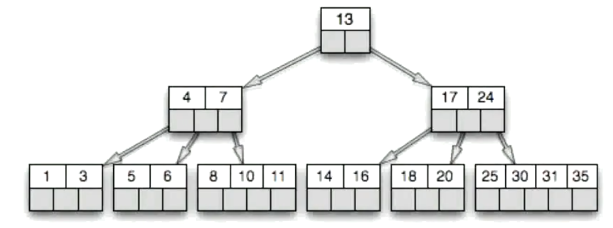
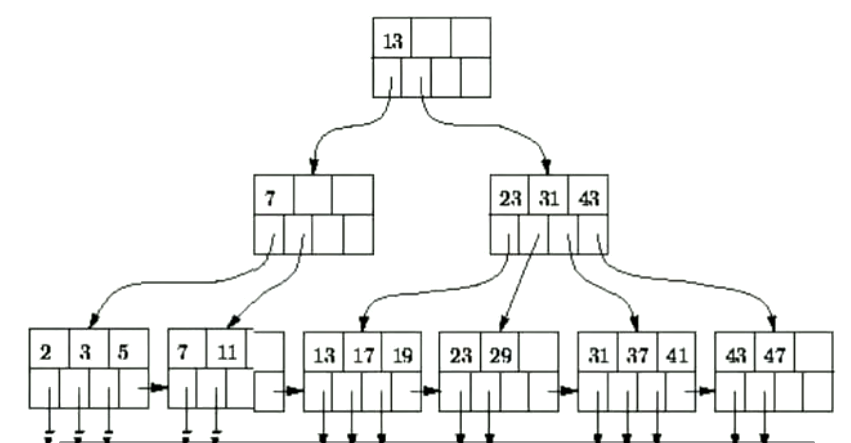
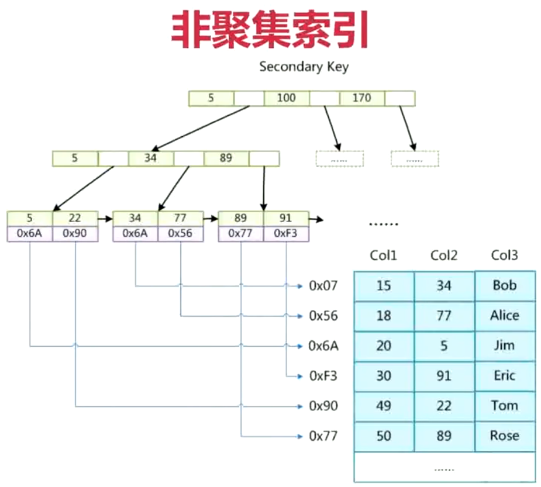
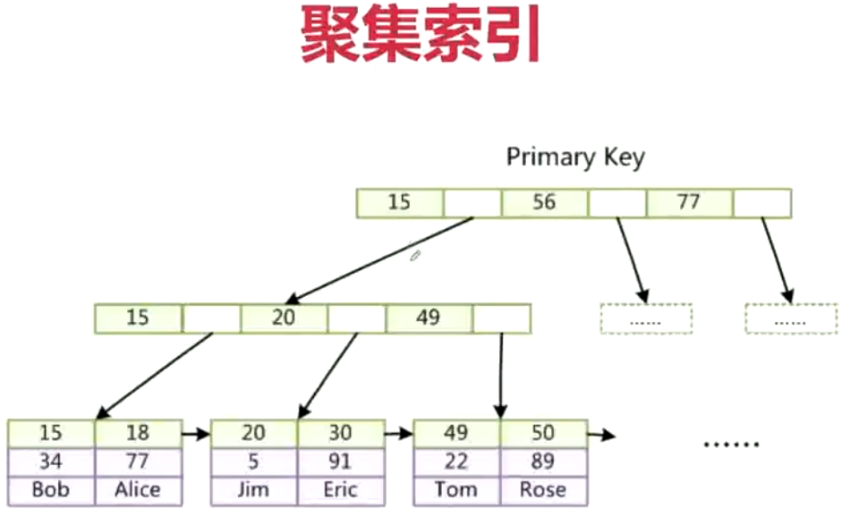
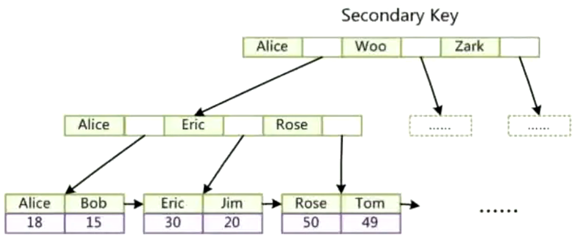
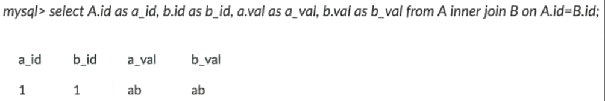
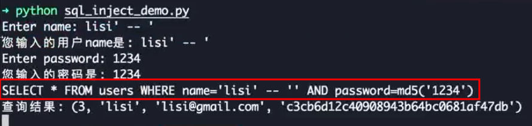
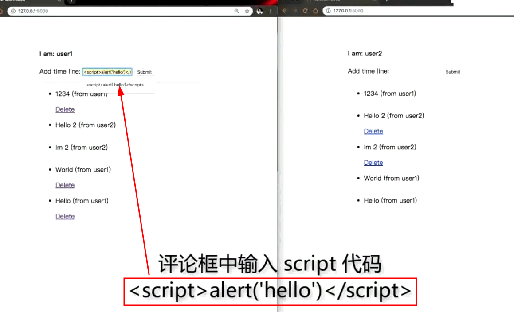
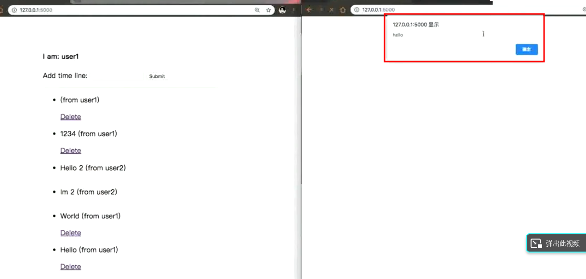

# 

## 什么是鸭子类型

** 鸭子类型(Duck Typing)是一种动态类型的编程概念，指使用一个对象的实际属性和方法来判断其类型，而不是依赖于明确的类型定义。这种概念可以让程序更加灵活，因为它允许不同类型的对象通过共享相同的属性和方法而完成相同的操作。鸭子类型的名字来自于“走起来像鸭子、叫起来像鸭子”的说法，即如果一个对象看起来像一只鸭子，走起路来也像鸭子，那么它就应该被视为一只鸭子。 **

- 关注点在对象的行为，而不是类型(duck typing)
- 比如 file，StringIO，socket 对象都支持read／write方法(file like object)
- 再比如定义了＿iter＿魔术方法的对象可以用for迭代

```python
class Duck:
  def quack(self):
    print("gua gua")


class Person:
  def quack(self):
    print(＂我是人类，但我也会 gua gua gua＂)


def in_the_forest(duck):
  duck.quack()


def game():
  donald=Duck()
  john=Person()
  in_the_forest(donald)
  in_the_forest(john)


game()
```


## 什么是monkey patch

** 什么是monkey patch？哪些地方用到了？自己如何实现？**

monkey patch是指在运行时修改已有代码的技术。这种技术可以在不修改原始代码的情况下，实现对代码的扩展和修复，甚至可以用来替换掉不好用或有缺陷的第三方库的某些方法。

在Python中，monkey patch广泛应用于测试和调试场景中。在测试中，可以用monkey patch来mock掉一些方法或数据，以便测试特定的代码路径、异常情况或部分逻辑；在调试中，可以用monkey patch来临时修改某个函数或方法，以便跟踪代码执行过程中的问题。

自己实现monkey patch可以按以下步骤进行：

1. 导入某个需要修改的模块或函数；

2. 对其需要修改的方法或属性进行重写或替换；

3. 执行修改后的代码；

4. 修改结束后恢复原有的方法或属性，以防止对其他代码造成影响。

例如，下面的代码演示了如何在运行时monkey patch一个函数：

```python
from module import function_to_patch

def new_function(*args, **kwargs):
    # 定义一个新的函数，处理原函数无法解决的逻辑
    pass

# monkey patch原函数
function_to_patch = new_function

# 执行代码
...
```

这里的模块`module`中有一个`function_to_patch`函数，需要被修改。我们定义了一个新的函数`new_function`，并将其赋值给`function_to_patch`变量，从而实现了对原函数的重写。当执行代码时，调用`function_to_patch`时，实际上执行的是我们新定义的函数`new_function`。


## 什么是自省

** Introspection **

- Python自省是指Python解释器在运行时能够查询对象的各种信息，包括类型、属性、方法、模块、函数等等。Python自省使得开发者可以动态地检查代码并用这些信息进行调试和优化

- Python自省的一些常用函数和方法包括：type()，dir()，vars()，help()，getattr()，setattr()，hasattr(), id(), isinstance()等等。这些函数和方法可以用来查询对象的各种信息，比如对象的类型、对象的属性和方法、模块的变量和函数等等。同时，Python还有一些特殊方法(比如__class__、__dict__、__dir__等等)可以用于自省

- Inspect 模块提供了更多获取对象信息的函数


## 什么是列表和字典推导

** List Comprehension **

- 列表推导是一种使用一行代码快速生成新列表的方法。它的基本语法如下：

```
[expression for item in iterable if condition]
```

其中，expression是用于生成新列表元素的表达式，item是从可迭代对象中取出的元素，可迭代对象可以是列表、元组、集合、字典等，if condition是选择性的条件语句。列表推导中的if语句可以省略。

例如，以下代码可以从原列表中筛选出大于10的元素，并生成新列表：

```
numbers = [1, 5, 11, 7, 9, 8, 15]
new_numbers = [num for num in numbers if num > 10]
print(new_numbers)

(i for i in range(10) if i％2 == 0)  # 返回生成器
```

输出：

```
[11, 15]
```

- 字典推导与列表推导类似，只是使用花括号{}来生成新字典。它的基本语法如下：

```
{key_expression: value_expression for item in iterable if condition}
```

其中，key_expression和value_expression是用于生成新字典键值对的表达式。如果不需要生成值，也可以省略value_expression。其他参数和列表推导相同。

```
a = ['a', 'b', 'c']
b = [1, 2, 3]

d = {k: v for k, v in zip(a, b)}
print(d)
```

输出：

```
{'a': 1, 'b': 2, 'c': 3}
```


## python3改进

1. 语法：Python3 的语法更加简洁，具有更好的可读性和可维护性。

2. 打印：在Python2中，使用print语句打印输出，而在Python3中使用print()函数。

3. 整数运算：Python2中整数运算返回整数，而Python3中整数运算返回浮点数。

4. 字符串编码：Python2默认使用ASCII编码，而Python3默认使用UTF-8编码。

5. 除法：Python2中，整数之间的除法结果将会向下取整，而在Python3中，整数之间的除法结果将会是浮点数。

6. range函数：Python2中的range函数返回一个列表，而Python3中的range函数返回一个可迭代对象。

7. 异常处理：Python2中使用except Exception, e的语法来捕获异常，而Python3中使用except Exception as e的语法。

8. 类型注解(type hint): 帮助IDE实现类型检查

9. 优化的super(): 方便直接调用父类函数
`super(C, self).hello()  #py2 super().hello()  # py3`

10. 高级解包操作: a, b, *rest = range(10)

11. 限定关键字参数(Keyword only arguments): **表示限制关键字参数

12. 异常链: Python3通过raise from 将原始异常和新异常一起抛出

13. 一切返回迭代器: range, zip, map, dict.values...

14. yield from 链接子生成器

15. asyncio内置库，async／await 原生协程支持异步编程

16. 新的内置库 enum，mock，asyncio，ipaddress，concurrent.futures 等

17. 生成的pyc文件统一放到__pycache__

18. 一些内置库的修改。urllib, selector等

总的来说，Python3相对于Python2来说更新了很多内容和语法，更加简洁、易读、易用。但是Python 2仍然广泛使用，在某些场景下仍然有很高的价值。


## 函数相关
### python如何传递参数

- 传递值还是引用？都不是。唯一支持的参数传递是共享传参
- 共享传参(Call by sharing): 函数形参获得实参中各个引用的副本


### python可变/不可变对象

- 不可变对象: bool/int/float/tuple/str/frozenset
- 可变对象: list/set/dict


### python函数传递中*args和**kwargs

- 用来处理可变参数
- *args被打包成tuple
- **kwargs被打包成dict

```python
def print_multiple_args(*args):
    print(type(args), args)
    for idx, val in enumerate(args):
        print(idx, val)


def print_kwargs(**kwargs):
    print(type(kwargs), kwargs)
    for k, v in kwargs.items():
        print('{}: {}'.format(k, v))


print_multiple_args('a', 'b', 'c')
print_multiple_args(*['a', 'b', 'c'])
print_kwargs(a=1, b=2)
print_kwargs(**dict(a=1, b=2))
```
 


## GIL(全局解释器锁)
### 什么是Cpython GIL

- GIL: Global Interpreter Lock
- Cpython解释器的内存管理并不是线程安全的
- 保护多线程情况下对Python对象的访问，Cpython使用简单的锁机制避免多个线程同时执行字节码


### GIL的影响

**限制了程序的多核执行**

- 同一时间只能有一个线程执行字节码
- CPU密集程序难以利用多核优势
- IO期间会释放GIL,对IO密集程序影响不大


### 如何规避GIL影响

**区分CPU和IO密集程序**

- CPU密集: 多进程 + 进程池
- IO密集: 多线程/协程
- cython扩展


### GIL的实现

 

### 为什么有了GIL还要关注线程安全

**Python中什么操作才是原子的？一步到位执行完**

- 一个操作如果是一个字节码指令可以完成就是原子的
- 原子的是可以保证线程安全的，因为同一时刻只能有一个线程执行同一个字节码
- 使用dis操作来分析字节码


## 性能分析

### 分析工具

- 内置的profile/cprofile工具分析
- web应用: 使用pyflame(uber开源)的火焰图工具

### 服务端性能优化措施

**web应用一般语言不会成为瓶颈**

- 数据结构与算法优化
- 数据库层: 索引优化，消除慢查询，批量操作减少IO，NoSQL
- 网络IO: 批量操作/pipeline操作减少IO
- 缓存: 使用内存数据库 redis/memcache
- 异步: asyncio, celery
- 并发: gevent/多线程


## 生成器&协程

### 生成器(generator)

- 生成器就是可以生成值的函数
- 当一个函数里有了yield关键字就成了生成器
- 生成器可以挂起执行并且保持当前执行的状态

```python
def simple_gen():
    yield "hello"
    yield "world"


gen = simple_gen()
print(type(gen))  # 'generator' object
print(next(gen))  # 'hello'
print(next(gen))  # 'world'
```

### 基于生成器的协程
**python3之前没有原生协程，只有基于生成器的协程**

- pep342增强生成器功能
- 生成器可以通过yield暂停执行和产出数据
- 同时支持send()向生成器发送数据和throw()向生成器抛出异常

```python
def coro():
    hello = yield 'hello'  # yield关键字在=右边作为表达式，可以被send值
    yield hello


c = coro()
# 输出hello,这里调用next产出第一个值hello，之后函数暂停
print(next(c))
# 再次调用send发送值,此时hello变量赋值为'world',然后yield产出hello变量的值'world'
print(c.send('world'))
# 之后协程结束，后续再send值会抛出异常StopIteration
```

### 协程注意点
- 协程需要使用send(None)或者next(coroutine)来预激(prime)才能启动
- 在yield处协程会暂停执行
- 单独的yield value会产出值给调用方
- 可以通过coroutine.send(value)来给协程发送值，发送的值会赋值给yield表达式左边的变量
- 协程执行完成后(没有遇到下一个yield语句)会抛出StopIteration异常

### 协程装饰器
**避免每次都要send预激它**
```python
from functools import wraps


def coroutine(func):  # 这样就不用每次都send(None)启动了
    """装饰器:向前执行到第一个yield表达式，预激func"""
    @wraps(func)
    def primer(*args, **kwargs):
        gen = func(*args, **kwargs)
        next(gen)
        return gen
    return primer
```

### python3.5之后的原生协程
**python3.5引入async/await支持原生协程(native coroutine)**
```python
import asyncio
import datetime
import random


async def display_date(num, loop):
    end_time = loop.time() + 50.0
    while True:
        print('Loop: {} Time: {}'.format(num, datetime.datetime.now()))
        if (loop.time()+1.0) >= end_time:
            break
        await asyncio.sleep(random.randint(0, 5))


loop = asyncio.get_event_loop()
asyncio.ensure_future(display_date(1, loop))
asyncio.ensure_future(display_date(2, loop))
loop.run_forever()
```


## 深拷贝vs浅拷贝

### 什么是深拷贝、浅拷贝
- 浅拷贝: 重新分配一块内存，创建一个新的对象，但里面的元素是原对象中各个子对象的引用
- 深拷贝: 重新分配一块内存，创建一个新的对象，且里面的元素也是以递归的方式创建新的子对象并拷贝到新对象中
- 引用:   变量的赋值

### python中如何实现深拷贝
**通过deep.deepcopy()**

```python
import copy


def refer():
    """对象引用"""
    a = [[1, 2], 3]
    b = a
    print("refer:   a is b? {}".format(a is b))


def shallow_copy():
    """浅拷贝"""
    a = [[1, 2], 3]
    b = copy.copy(a)
    print("shallow: a is b? {}".format(a is b))
    print("shallow: a[0] is b[0]? {}".format(a[0] is b[0]))
    b[0].append(0)
    print("shallow: a={}, b={}".format(a, b))


def deep_copy():
    """深拷贝"""
    a = [[1, 2], 3]
    b = copy.deepcopy(a)
    print("deep:    a is b? {}".format(a is b))
    print("deep:    a[0] is b[0]? {}".format(a[0] is b[0]))
    b[0].append(0)
    print("deep:    a={}, b={}".format(a, b))


refer()
shallow_copy()
deep_copy()
```
 

### python中如何正确初始化一个二维数组

***方式二实际上并不是创建了一个新的二维数组，而是创建了三个指向array的引用***
```python
# 方式一: 列表推导式方式
n, m = 3, 4
a = [[0 for _ in range(m)] for i in range(n)]
print(a)
a[0][0] = 1
print(a)
for i in range(n):
    print("第{}个元素的地址是: {}".format(i, id(a[i])))
print()


# 方式二
array = [0 for _ in range(m)]
matrix = [array] * n
print(matrix)
matrix[0][0] = 1
print(matrix)
for i in range(n):
    print("第{}个元素的地址是: {}".format(i, id(matrix[i])))
```
 


## 数据结构与算法
pass


## 面向对象

### 组合与继承
**优先使用组合而非继承**

- 组合是使用其他的类实例作为自己的一个属性(Has-a关系)
- 子类继承父类的属性和方法(Is-a关系)
- 优先使用组合保持代码简单

### 类变量和实例变量
- 类变量由所有实例共享
- 实例变量由实例单独享有，不同实例之间不影响
- 当我们需要在一个类的不同实例之间共享变量的时候使用类变量

### classmethod vs staticmethod
- 都可以使用Class.method()的方式使用
- classmethod第一个参数是cls,可以引用类变量
- staticmethod使用起来和普通函数一样，只不过放在类里去组织

### 元类
**元类(Meta Class)是创建类的类**

- 元类允许我们控制类的生成，比如修改类的属性等
- 使用type来定义元类
- 元类最常见的一个使用场景就是ORM框架

```python
# 一、等价定义
class Base:
    pass

class Child(Base):
    pass

# 等价定义: 注意Base后要加上逗号,否则就不是tuple了
SameChild = type('Child', (Base,), {})


# 二、等价定义
# 加上方法
class ChildWithMethod(Base):
    bar = True

    def hello(self):
        print('hello')

def hello(self):
    print('hello')

# 等价定义
SameChildWithMethod = type('SameChildWithMethod', (Base,), {'bar': True, 'hello': hello})


# 三、编写自己的元类
# 元类继承自 type
class LowercaseMeta(type):
    """ 修改类的属性名称为小写的元类 """
    def __new__(cls, name, base, attrs):
        lower_attrs = {}
        for k, v in attrs.items():
            if not k.startswith('__'):  # 排除魔法方法
                lower_attrs[k.lower()] = v
            else:
                lower_attrs[k] = v
        return type.__new__(cls, name, base, lower_attrs)

class LowercaseClass(metaclass=LowercaseMeta):
    BAR = True

    def HELLO(self):
        print('hello')

print(dir(LowercaseClass))
"""
['__class__', '__delattr__', '__dict__', '__dir__', '__doc__', '__eq
__', '__format__', '__ge__', '__getattribute__', '__gt__', '__hash__
', '__init__', '__init_subclass__', '__le__', '__lt__', '__module__'
, '__ne__', '__new__', '__reduce__', '__reduce_ex__', '__repr__', '_
_setattr__', '__sizeof__', '__str__', '__subclasshook__', '__weakref
__', 'bar', 'hello']
"""
```


## 装饰器(Decorator)
### 什么是装饰器

- Python中一切皆对象，函数也可以当作参数传递
- 装饰器是接受函数作为参数，添加功能后返回一个新函数的函数(类)
- python中通过@使用装饰器

### 函数装饰器
```python
import time

def log_time(func):
    def _log(*args, **kwargs):
        beg = time.time()
        res = func(*args, **kwargs)
        print('use time: {}'.format(time.time()-beg))
        return res
    return _log


@log_time
def mysleep():
    time.sleep(1)


mysleep()
```

### 类装饰器
```python
import time

class LogTime:
    def __call__(self, func):
        def _log(*args, **kwargs):
            beg = time.time()
            res = func(*args, **kwargs)
            print('use time: {}'.format(time.time()-beg))
            return res
        return _log

@LogTime()
def mysleep():
    time.sleep(1)


mysleep()
```

### 带参数的装饰器
```python
import time

class LogTimeParams:
    def __init__(self, use_int=False):
        self.use_int = use_int

    def __call__(self, func):
        def _log(*args, **kwargs):
            beg = time.time()
            res = func(*args, **kwargs)
            if self.use_int:
                print('use time: {}'.format(int(time.time()-beg)))
            else:
                print('use time: {}'.format(time.time()-beg))
            return res
        return _log

@LogTimeParams(True)
def mysleep():
    time.sleep(1)

mysleep()
```


## 设计模式
### 创建型
- 工厂模式(Factory):解决对象创建问题
- 构造模式(Builder): 控制复杂对象的创建
- 原型模式(Prototype): 通过原型的克隆创建新的对象
- 单例模式(Borg/Singleton): 一个类只能创建同一个对象
- 对象池模式(Pool): 预先分配同一类型的一组实例
- 惰性计算模式(Lazy Evaluation): 延迟计算(Python的property)
#### 工厂模式
**什么是工厂模式**

- 解决对象创建问题
- 解藕对象的创建和使用
- 包括工厂方法和抽象工厂

```python
DogToy:
    def speak(self):
        print('wang wang')


CatToy:
    def speak(self):
        print('miao miao')


def toy_factory(toy_type):
    if toy_type == 'dog':
        return DogToy()
    elif toy_type == 'cat':
        return CatToy()
```

#### 构造模式
**什么是构造模式**

- 用来控制复杂对象的构造
- 创建和表示分离
- 比如你要买电脑，工厂模式直接给你需要的电脑;构造模式允许你自定义电脑的配置，组装完成后给你

```python
class Computer:
    def __init__(self, serial_number):
        self.serial = serial_number
        self.memory = None
        self.hdd = None
        self.gpu = None

    def __str__(self):
        info = (
            'Memory: {}GB'.format(self.memory),
            'Hard Disk: {}GB'.format(self.hdd),
            'Graphics Card: {}'.format(self.gpu)
        )
        return '\n'.join(info)


class ComputerBuilder:
    def __init__(self):
        self.computer = Computer('e91f872c')

    def config_memory(self, memory):
        self.computer.memory = memory

    def config_hdd(self, hdd):
        self.computer.hdd = hdd

    def config_gpu(self, gpu):
        self.computer.gpu = gpu


class HardwareEngineer:
    def __init__(self):
        self.builder = None

    def construct_computer(self, memory, hdd, gpu):
        self.builder = ComputerBuilder()
        [step for step in (
            self.builder.config_memory(memory),
            self.builder.config_hdd(hdd),
            self.builder.config_gpu(gpu)
            )]

    @property
    def computer(self):
        return self.builder.computer


engineer = HardwareEngineer()
engineer.construct_computer(hdd=500, memory=8, gpu='GTX 650 Ti')
computer = engineer.computer
print(computer)
```

#### 原型模式
**什么是原型模式**

- 通过克隆原型来创建实例
- 可以使用相同的原型，通过修改部分属性来创建新的实例
- 用途：对于一些创建实例开销比较高的地方可以用原型模式
```python
import copy

class Prototype:
    def __init__(self, obj):
        self.obj = obj
    
    def clone(self):
        return copy.deepcopy(self.obj)

class Book:
    def __init__(self, name, authors, price, **rest):
        self.name = name
        self.authors = authors
        self.price = price
        self.rest = rest
    
    def __str__(self):
        return f'{self.name} by {", ".join(self.authors)} (${self.price})'

book = Book('Python 101', ['John Doe', 'Jane Doe'], 49.9)
prototype = Prototype(book)
clone = prototype.clone()

print(book)
print(clone)
print(id(book) == id(clone))  # False, object clones are different
```

#### 单例模式
**重要，需要手写**

- 一个类创建出来的对象都是同一个
- Python的模块其实就是单例的，只会导入一次
- 使用共享同一个实例的方式来创建单例模式
```python
# 1、继承类实现
class Singleton:
    def __new__(cls, *args, **kwargs):
        if not hasattr(cls, '_instance'):
            _instance = super().__new__(cls, *args, **kwargs)
            cls._instance = _instance
        return cls._instance


class MyClass(Singleton):
    pass


c1 = MyClass()
c2 = MyClass()
print(c1 is c2)  # True


# 2、装饰器实现
def singleton(class_):
    instances = {}

    def get_instance(*args, **kwargs):
        if class_ not in instances:
            instances[class_] = class_(*args, **kwargs)
        return instances[class_]
    return get_instance

@singleton
class Singleton:
    pass

s1 = Singleton()
s2 = Singleton()
print(s1 is s2)  # True


# 3、元类实现
class Singleton(type):
    _instances = {}

    def __call__(cls, *args, **kwargs):
        if cls not in cls._instances:
            cls._instances[cls] = super().__call__(*args, **kwargs)
        return cls._instances[cls]

class Logger(metaclass=Singleton): 
    pass

logger1 = Logger()
logger2 = Logger()
print(logger1 is logger2)  # True
```

### 结构型
- 装饰器模式(Decorator): 无需子类化扩展对象功能
- 代理模式(Proxy): 把一个对象的操作代理到另一个对象
- 适配器模式(Adapter): 通过一个间接层适配统一接口
- 外观模式(Facade): 简化复杂对象的访问问题
- 享元模式(Flyweight): 通过对象复用(池)改善资源利用，比如连接池
- Model-View-Controller(MVC): 解藕展示逻辑和业务逻辑
#### 代理模式
- 把一个对象的操作代理到另一个对象
- 通常使用has-a组合关系
```python
# 定义了一个主题接口(Subject)及其真实主题(RealSubject)和代理(Proxy)
# `Proxy`继承自主题,并在发送请求前记录日志。客户端通过主题接口与代理进行交互,
# 代理会代理真实主题来完成操作,并添加额外的功能(如日志)

import logging

class Subject: 
    def __init__(self):
        self.subject = RealSubject()

    def request(self):
        self.subject.request()

class RealSubject: 
    def request(self):
        print('Real request.')

class Proxy(Subject): 
    def __init__(self):
        Subject.__init__(self)
        self.logger = logging.getLogger('proxy_logger')

    def request(self):
        self.logger.debug('Proxy: Method called.')
        Subject.request(self)

if __name__ == '__main__': 
    proxy = Proxy()
    proxy.request()
```

#### 适配器模式
- 把不同对象的接口适配到同一个接口
- 当我们需要给不同的对象统一接口时可以使用适配器模式
- 想象一个多功能重点头，可以给不同的电器充电，充当了适配器
```python
class Dog:
    def __init__(self):
        self.name = 'Dog'

    def bark(self):
        return "woof!"


class Cat:
    def __init__(self):
        self.name = 'Cat'

    def meow(self):
        return "meow!"


class Adapter:
    def __init__(self, obj, **adapted_method):
        self.obj = obj
        self.__dict__.update(adapted_method)

    def __getattr__(self, attr):
        return getattr(self.obj, attr)


objects = []
dog = Dog()
objects.append(Adapter(dog, make_noise=dog.bark))
cat = Cat()
objects.append(Adapter(cat, make_noise=cat.meow))
for obj in objects:
    print("A {0} goes {1}".format(obj.name, obj.make_noise()))
```

### 行为型
- 迭代器模式(Iterator): 通过统一的接口迭代对象
- 观察者模式(Observer): 对象发生改变的时候，观察者执行相应动作
- 策略模式(Strategy): 针对不同规模输入使用不同的策略
#### 迭代器模式
- Python内置对迭代器模式的支持
- 比如我们可以用for遍历各种Iterable的数据类型
- Python里可以实现__next__和__iter__实现迭代器;实现__iter__实现可迭代对象
```python
# 通过__next__和__iter__实现
class Countdown:
    def __init__(self, n):
        self.n = n
    
    def __iter__(self):
        return self
    
    def __next__(self):
        if self.n <= 0:
            raise StopIteration
        self.n -= 1
        return self.n

for num in Countdown(3):
    print(num)


# 通过yield实现
def count_to_ten():
    for num in range(1, 11):
        yield num

iterator = count_to_ten()
for num in iterator:
    print(num) 
```

#### 观察者模式
- 发布订阅是一种最常用的实现方式
- 用于解藕逻辑
- 可以通过回调等方式实现，当发生事件事件时，调用相应的回调函数
```python
class Publisher:  # 发布者
    def __init__(self):
        self.observers = []  # 观察者

    def add(self, observer):  # 加入观察者
        if observer not in self.observers:
            self.observers.append(observer)
        else:
            print("Failed to add: {}".format(observer))

    def remove(self, observer):  # 移除观察者
        try:
            self.observers.remove(observer)
        except ValueError:
            print("Failed to remove: {}".format(observer))

    def notify(self):  # 调用观察者的回调
        [o.notify_by(self) for o in self.observers]


class Formatter(Publisher):
    def __init__(self, name):
        super().__init__()
        self.name = name
        self._data = 0

    @property
    def data(self):
        return self._data

    @data.setter
    def data(self, new_value):
        self._data = int(new_value)
        self.notify()  # data被赋值后会执行notify


class BinaryFormatter:  # 订阅者
    def notify_by(self, publisher):
        print(
            "{}: '{}' has now bin data = {}".format(
                type(self).__name__,
                publisher.name,
                bin(publisher.data)
            )
        )


df = Formatter('formatter')
bf = BinaryFormatter()
df.add(bf)
df.data = 3
```

#### 策略模式
- 根据不同的输入采用不同的策略
- 比如买东西操作10个打八折，操作20个打七折
- 对外暴露统一的接口，内部采用不同的策略计算
```python
class Order:
    def __init__(self, price, discount_strategy=None):
        self.price = price
        self.discount_strategy = discount_strategy

    def price_after_discount(self):
        if self.discount_strategy:
            discount = self.discount_strategy(self)
        else:
            discount = 0
        return self.price - discount

    def __repr__(self):
        fmt = "<Price: {}, price after discount: {}>"
        return fmt.format(
            self.price, self.price_after_discount()
        )

def ten_percent_discount(order):
    return order.price * 0.10


def on_sale_discount(order):
    return order.price * 0.25 + 20


order0 = Order(100)
order1 = Order(100, ten_percent_discount)
order2 = Order(100, on_sale_discount)
print(order0)
print(order1)
print(order2)
```


## 操作系统
### 内存管理机制
#### 分页机制
**逻辑地址和物理地址分离的内存分配管理方案。操作系统为了高效管理内存，减少碎片**

- 程序的逻辑地址划分为固定大小的页(Page)
- 物理地址划分为同样大小的帧(Frame)
- 通过页表对应逻辑地址和物理地址 


#### 分段机制
**为了满足代码的一些逻辑需求**

- 数据共享，数据保护，动态链接等
- 通过段表实现逻辑地址和物理地址的映射关系
- 每个段内部是连续内存分配，段和段之间是离散分配


#### 分页和分段的区别
- 页是出于内存利用率的角度提出的离散分配机制
- 段是出于用户角度，用于数据保护、数据隔离等用途的管理机制
- 页的大小是固定的，操作系统决定;段的大小不确定，用户程序决定
#### 虚拟内存
**通过把一部分暂时不用的内存信息放到硬盘上**

- 局部性原理，程序运行时候只有部分必要的信息装入内存
- 内存中暂时不需要的内容放到硬盘
- 系统似乎提供了比实际内存大的多的容量，称之为虚拟内存
#### 内存抖动
**本质是频繁的页调度行为**

- 频繁的页调度，进程不断产生缺页中断
- 置换一个页，又不断再次需要这个页
- 运行程序太多，页面替换策略不好。终止进程或增加物理内存
#### python垃圾回收机制
- 引用计数为主(缺点：循环引用无法解决)
- 引入标记清除和分代回收解决引用计数的问题
- 引用计数为主+标记清除和分代回收为辅

##### 引用计数

##### 循环引用

##### 标记清除

##### 分代回收


## 网络编程
### 浏览器输入一个url中间经历的过程
`DNS查询 -> TCP握手 -> HTTP请求 -> 反向代理Ngix -> uwsgi/gunicorn -> web app响应 -> TCP挥手`
### TCP/UDP协议
#### TCP三次握手过程

#### TCP四次挥手过程

#### TCP/UDP的区别
- TCP: 面向连接、可靠的、基于字节流
- UDP: 无连接、不可靠、面向报文
### HTTP协议
#### HTTP请求的组成
- 状态行
- 请求头
- 消息主体
#### HTTP响应的组成
- 状态行
- 响应头
- 响应正文
#### HTTP状态码
- 1×× - 信息：服务器收到请求，需要请求者继续执行操作
- 2×× - 成功：操作被成功接收并处理
- 3×× - 重定向：需要进一步操作完成请求
- 4×× - 客户端错误：请求有语法错误或者无法完成请求
- 5×× - 服务器错误：服务器在处理请求的过程中发生错误
#### HTTP长连接
- 短连接：建立连接...数据传输...关闭连接(连接的建立和关闭开销大)
- 长连接：Connection: Keep-alive。保持TCP连接不断
- 如何区分不同的HTTP请求？Content-Length|Transfer-Encoding:chunked
#### cookie和session的区别
**HTTP是无状态的，如何识别用户？**
- Session一般是服务器生成之后给客户端(通过url参数或cookie)
- Cookie是实现session的一种机制，通过HTTP cookie字段实现
- Session通过在服务器保存sessionid识别用户，cookie存储在客户端
#### TCP Socket编程原理
- 如何使用socket模块
- 如何建立TCP Socker客户端和服务端
- 客户端和服务端之间的通信


##### socket客户端
```python
import socket

s = socket.socket(socket.AF_INET, socket.SOCK_STREAM)
s.connect(('127.0.0.1', 8888))
s.sendall(b'Hello World')
data = s.recv(1024)
print(data.decode())
s.close()
```

##### socket服务端
```python
import socket
import time

s = socket.socket()
s.bind(('', 8888))
s.listen()

while True:
    client, addr = s.accept()
    print(client)
    timer = time.ctime(time.time()) + '\r\n'
    client.send(timer.encode())
    client.close()
```

#### HTTP Socket编程原理
**如何使用socket发送http请求**

- 使用socket接口发送http请求
- HTTP建立在TCP基础之上
- HTTP是基于文本的协议
```python
import socket

s = socket.socket()
s.connect(('www.baidu.com', 80))

http = b"GET / HTTP/1.1\r\nHost: www.baidu.com\r\n\r\n"
s.sendall(http)
buf = s.recv(1024)
print(buf)
s.close()
```

### IO多路复用
#### 五种IO模型
- 阻塞IO(Blocking IO)
- 非阻塞IO(Nonblocking IO)
- IO多路复用(IO multiplexing)
- 信号驱动IO(Signal Driven IO)
- 异步IO(Asynchronous IO)
#### 如何提升服务端并发能力
- 多线程模型：创建新的线程处理请求
- 多进程模型：创建新的进程处理请求
- *线程/进程创建开销比较大，可以用线程池方式解决;进程线程比较占用资源，难以同时创建太多*
- IO多路复用：实现单进程同时处理多个socket请求
#### 什么是IO多路复用
**操作系统提供的同时监听多个socket的机制**

- 为了实现高并发需要一种机制并发处理多个socket
- Linux常见的是select/poll/epoll
- 可以使用单进程单线程处理多个socket

```python
while True:
    events = sel.select()
    for key, mask in events:
        callback = key.data
        callback(key.fileobj, mask)
```


#### python如何实现IO多路复用
**python封装了操作系统的IO多路复用**

- Python的IO多路复用基于操作系统实现(select/poll/epoll)
- Python2 select模块
- Python3 selectors模块
### python并发网络编程
#### 常用的并发网络库
- Tornado: 并发网络库，同时也是一个web微框架
- Gevent：绿色线程(greenlet)实现并发，猴子补丁修改内置socket
- Asyncio：Python3内置的并发网络库，基于原生协程
#### Tornado框架
**Tornado适用于微服务，实现Restful接口**

- 底层基于Linux多路复用
- 可以通过协程或者回调实现异步编程
- 生态不完善，相应的异步框架比如ORM不完善
```python
import tornado.ioloop
import tornado.web
from tornado.httpclient import AsyncHTTPClient


class APIHandler(tornado.web.RequestHandler):
    async def get(self):
        url = 'http://httpbin.org/get'
        http_client = AsyncHTTPClient()
        resp = await http_client.fetch(url)
        print(resp.body)
        return resp.body


def make_app():
    return tornado.web.Application([
        (r"/api", APIHandler),
    ])


if __name__ == "__main__":
    app = make_app()
    app.listen(8888)
    tornado.ioloop.IOLoop.current().start()
```
#### Gevent
**高性能的并发网络库**

- 基于轻量级路色线程(greenlet)实现并发
- 需要注意monkey patch, gevent修改了内置的socket改为非阻塞
- 配合gunicorn和gevent部署作为wsgi server
- 学习资料：<<Gevent程序员指南>>
```python
import gevent.monkey
gevent.monkey.patch_all()

import gevent
import requests


def fetch(i):
    url = 'http://httpbin.org/get'
    resp = requests.get(url)
    print(len(resp.text), i)

def asynchronous():
    threads = []
    for i in range(1, 10):
        threads.append(gevent.spawn(fetch, i))
    gevent.joinall(threads)


print('Asynchronous:')
asynchronous()
```
#### Asyncio
**基于协程实现的内置并发网络库**

- Python3引入到内置库，协程+事件循环
- 生态不够完善，没有大规模生产环境检验
- 目前应用不够广泛，基于Aiohttp可以实现一些小的服务
```python
import asyncio
from aiohttp import ClientSession

async def fetch(url,session):
    async with session.get(url) as response:
        return await response.read()

async def run(r=10):
    url = "http://httpbin.org/get"
    tasks = []

    async with ClientSession() as session:
        for i in range(r):
            task = asyncio.ensure_future(fetch(url, session))
            tasks.append(task)
        responses = await asyncio.gather(*tasks)
        for resp_body in responses:
            print(len(resp_body))

loop = asyncio.get_event_loop()
future = asyncio.ensure_future(run())
loop.run_until_complete(future)
```

## Mysql
### 事务
#### 什么是事务(Transaction)
- 事务是数据库并发控制的基本单位
- 事务可以看作是一系列SQL语句的集合
- 事务必须要么全部执行成功，要么全部执行失败(回滚)
#### 事务的ACID特性
- 原子性(Atomicity): 一个事务中所有操作全部完成或失败
- 一致性(Consistency): 事务开始和结束之后数据完整性没有被破坏
- 隔离性(Isolation): 允许多个事务同时对数据库修改和读写
- 持久性(Durability): 事务结束之后，修改是永久的不会丢失
#### 事务的并发控制
**如果不对事务进行并发控制，可能产生四种异常情况**

- 幻读(phantom read): 一个事务第二次查询出现第一次没有的结果
- 非重复读(nonrepeatable read): 一个事务重复读两次得到不同的结果
- 脏读(dirty read): 一个事务读取到另一个事务没有提交的修改
- 修改丢失(lost update): 并发写入造成其中一些修改丢失
#### 四种事务隔离级别
- 读未提交(read uncommitted): 别的事务可以读取到未提交的改变
- 读已提交(read committed): 只能读取已经提交的事务
- 可重复读(repeatable read): 同一个事务先后查询结果一样
- 串行化(Serializable): 事务完全串行化的执行，隔离级别最高，执行效率最低 
#### 高并发场景下的插入重复问题
**高并发场景下，写入数据库会有数据重复问题**

- 使用数据库的唯一索引(对于分库分表场景不适用)
- 使用队列异步写入
- 使用redis等实现分布式锁
#### 乐观锁和悲观锁
- 悲观锁是先获取锁再进行操作。一锁二查三更新(select for update)
- 乐观锁先修改，更新的时候发现数据已经变了就回滚(check and set), 一般通过版本号或时间戳实现
- 需要根据响应速度、冲突频率、重试代价来判断使用哪一种
### 常用数据类型
#### 字符串(文本)
| 类型 | 说明 |
|---|---|
| CHAR | 定长字符串,存储空间固定,效率高。长度范围0-255 |
| VARCHAR | 变长字符串,存储空间可变,效率低。长度范围0-65535 |
| TINYTEXT | 可存储 255 个字符的短文本串 |
| TEXT | 可存储 65535 个字符的长文本串 |
| MEDIUMTEXT | 可存储 16777215 个字符的中等长度文本串 |
| LONGTEXT | 可存储 4294967295 个字符的极大文本串 |
| ENUM | 枚举类型,可以在创建表时定义允许的选项 |
| SET | 也是枚举类型,但是可以选择多选 |

#### 数值
| 类型 | 大小 | 说明 |
|---|---|---|
| TINYINT | 1 bytes | 最小整数类型,范围 -128 到 127 或者无符号 0 到 255 |
| SMALLINT | 2 bytes | 小整数类型,范围 -32768 到 32767 或者无符号 0 到 65535 |
| MEDIUMINT | 3 bytes | 中等大小的整数类型,范围 -8388608 到 8388607 或者无符号 0 到 16777215 |
| INT | 4 bytes | 整数类型,范围 -2147483648 到 2147483647 或者无符号 0 到 4294967295 |
| BIGINT | 8 bytes | 大整数类型,范围 -9223372036854775808 到 9223372036854775807 或者无符号 0 到 18446744073709551615 |
| FLOAT | 4 bytes | 单精度浮点数类型 |
| DOUBLE | 8 bytes | 双精度浮点数类型 |
| DECIMAL |  | 精确的小数类型,通过指定两个参数来定义数字的精度和标度。 |
| NUMERIC |  | 也是精确的小数类型,语法同 DECIMAL |
| BIT |  | 比特类型,用来存放位字段 |

#### 日期和时间
| 类型 | 大小 | 说明 |
|---|---|---|
| DATE | 3 bytes | 日期类型,格式 YYYY-MM-DD,日期范围 1000-01-01 到 9999-12-31 |
| DATETIME | 8 bytes | 日期和时间类型,格式 YYYY-MM-DD HH:MM:SS,日期范围 1000-01-01 00:00:00 到 9999-12-31 23:59:59 |
| TIMESTAMP | 4 bytes | 时间戳类型,格式 YYYY-MM-DD HH:MM:SS,范围 1970-01-01 00:00:01 UTC 到 2038-01-19 03:14:07 UTC |
| TIME |  | 时间类型,格式 HH:MM:SS,时间范围 '-838:59:59' 到 '838:59:59' |
| YEAR |  | 年份类型,格式 YYYY,年份范围 1901 到 2155 |

### 引擎
#### InnoDB
- 支持事务
- 支持外键
- 支持行锁和表锁
#### MyISAM
- 不支持事务
- 不支持外键
- 只支持表锁
### 索引
#### 什么是索引
- 索引是数据表中一个或者多个列进行排序的数据结构
#### 为什么需要索引
- 索引能够大幅度提升检索速度
- 创建、更新索引本身也会耗费空间和时间
#### 索引的底层数据结构
**索引属于引擎，结构是B+树**
##### 什么是B-Tree
- 即多路平衡查找树，每个节点最多m(m>=2)个孩子，称为m阶或者度
- 叶子节点具有相同的深度
- 节点中的数据key从左到右是递增的


##### 什么是B+Tree
- B+Tree是B-Tree的变形
- 只在叶子节点带有指向记录的指针(为什么？可以增加树的度)
- 叶子节点通过指针相连(为什么？实现范围查询)


##### 为什么是B+Tree
**查找结构进化史**

|查找算法|说明|优点|缺点|
|---|---|---|---|
|线性查找|一个个的找|实现简单|速度太慢|
|二分查找|有序的结构|实现简单|要求有序，插入特别慢|
|Hash查找||查询特别快|占用空间，不太适合存储大规模的数据|
|二叉查找树||插入和查找都很快(log(n))|无法存储大规模的数据，存在复杂度退化成线性结构的问题|
|平衡树|解决bst(二叉查找树)复杂度退化问题，树是平衡的||当节点非常多的时候，树的深度依然很高|
|多路查找树|一个父节点可以有多个孩子节点(度/阶),<br>解决节点特别多的时候，树的深度不会特别高问题|||
|多路平衡查找树(B-tree)|集合平衡树和多路查找树|插入和查找都很友好|没法实现范围查找|
|B+Tree||||

#### 索引的类型
- 普通索引(CREATE INDEX)
- 唯一索引，索引列的值必须唯一(CREATE UNIQUE INDEX)
- 多列索引
- 主键索引，一个表只能有一个(PRIMARY KEY)
- 全文索引，通过倒排索引实现，InnoDB不支持(FULLTEXT INDEX)
#### 什么时候创建索引 
**建表的时候需要根据查询需求来创建索引**

- 经常用作查询条件的字段(WHERE条件)
- 经常用作表连接的字段
- 经常出现在order by, group by之后的字段
#### 创建索引有哪些需要注意的点
- 非空字段NOT NULL，Mysql很难对空值作查询优化
- 区分度高、离散度大，作为索引的字段值尽量不要有大量相同值
- 索引的长度不要太长(比较耗费时间)
#### 索引什么时候失效(慢查询)
**mysql B+树的key没法直接比较的时候**

- 以%开头的LIKE语句，模糊搜索
- 出现隐式类型转换，python传入的参数类型跟数据库表的类型不一样(在python这种动态语言中需要注意)
- 没有满足最左前缀原则
#### 什么是聚集索引和非聚集索引
- 聚集还是非聚集指的是B+Tree叶子节点存的是指针还是数据记录
- MyISAM索引和数据分离，使用的是非聚集索引

- InnoDB数据文件就是索引文件，主键索引就是聚集索引

#### 辅助索引
- 叶子节点存储的是主键的值
- 通过主键再去找到对应的数据

#### 如何排查慢查询
**慢查询通常是缺少索引、索引不合理或者业务代码实现导致**

- slow_query_log_file开启并查询慢查询日志
- 通过explain排查索引问题
- 调整数据修改索引;业务代码层限制不合理访问

### SQL语句
- 内连接(INNER JOIN): 两个表都存在匹配时，才会返回匹配行
- 外连接(LEFT/RIGHT JOIN): 返回一个表的行，即使另一个没有匹配
- 全连接(FULL JOIN): 只要某一个表存在匹配就返回
#### 内连接
- 将左表和右表能够关联起来的数据连接后返回
- 类似于求两个表的"交集"
- select * from A inner join B on a.id=b.id

#### 外连接
- 左连接返回左表中所有记录，即使右表中没有匹配的记录
- 右连接返回右表中所有记录，即使左表中没有匹配的记录
- 没有匹配的字段会设置成NULL

## Redis
### 为什么使用缓存
- 缓解关系数据库并发访问的压力：热点数据
- 减少响应时间：内存IO速度比磁盘快
- 提升吞吐量：Redis等内存数据库单机就可以支撑很大并发
### Redis和Memcached对比
|对比参数|Redis|Memcached|
|---|---|---|
|类型|1、支持内存<br>2、非关系型数据库|1、支持内存<br>2、key-value键值对形式<br>3、缓存系统|
|数据存储类型|1、String<br>2、List<br>3、Set<br>4、Hash<br>5、Sort Set(熟称ZSet)|1、文本型<br>2、二进制类型|
|查询(操作)类型|1、批量操作<br>2、事务支持(虽然是假的事务)<br>3、每个类型不同的CURD|1、CURD<br>2、少量的其他命令|
|附加功能|1、发布/订阅模式<br>2、主从分区<br>3、序列化支持<br>4、Lua脚本支持|多线程服务支持|
|网络IO模型|单进程模式|多线程、非阻塞IO模式|
|事件库|自封装简易事件库AeEvent|贵族血统的LibEvent事件库|
|持久化支持|1、RDB<br>2、AOF|不支持|

### Redis常用数据类型和使用场景
- String(字符串): 用来实现简单的KV键值对存储，比如计数器
- List(链表): 实现双向链表，比如用户的关注、粉丝列表
- Hash(哈希表): 用来存储彼此相关信息的键值对
- Set(集合): 存储不重复元素，比如用户的关注者
- Sorted Set(有序集合): 实时信息排行版
### Redis数据类型底层实现
- String: 整数或者sds(Simple Dynamic String)
- List: ziplist(通过一个连续的内存快实现list结构，其中的每个entry节点头部保存前后节点长度信息，实现双向链表功能)或者double linked list
- Hash: ziplist或者hashtable
- Set: intset或者hashtable
- SortedSet: skiplist跳跃表
### Redis两种持久化方式
- 快照方式：把数据快照放在磁盘二进制文件中，dump.rdb。实现方式是指定时间间隔把Redis数据库状态保存到一个压缩的二进制文件
- AOF(Append Only File): 每一个写命令追加到appendonly.aof中
- 可以通过修改Redis配置选择持久化方式
### Redis事务
- 将多个请求打包，一次性、按序执行多个命令的机制
- 通过MULTI、EXEC、WATCH等命令实现事务功能
- Python redis-py pipeline=conn.pipeline(transaction=True)开启事务
### Redis如何实现分布式锁
- 使用setnx实现加锁，可以同时通过expire添加超时时间
- 锁的value值可以使用一个随机的uuid或者特定的命名
- 释放锁的时候，通过uuid判断是否是该锁，是则执行delete释放锁
### 常用的缓存使用模式
- Cache Aside: 同时更新缓存和数据库
- Read/Write Through: 先更新缓存，缓存负责同步更新数据库
- Write Behind Caching: 先更新缓存，缓存定期异步更新数据库
### 缓存穿透问题
- 原因：由于大量缓存查询不到就去数据库取，数据库也没有要查的数据，导致数据库压力增大
- 解决：对于没查到返回为的数据也缓存;插入数据的时候删除相应缓存，或者设置较短的超时时间
### 缓存击穿问题
- 原因：热点数据key失效导致大量请求打到数据库增加数据库压力
- 解决：
    1. 分布式锁：获取锁的线程从数据库拉数据更新缓存，其他线程等待
    2. 异步后台更新：后台任务针对过期的key自动刷新
### 缓存雪崩问题
- 原因：缓存不可用或者大量缓存key同时失效，大量请求直接打到数据库
- 解决：
    1. 多级缓存：不同级别的key设置不同的超时时间
    2. 随机超时：key的超时时间随即设置，防止同时超时
    3. 架构层：提升系统可用性。监控、报警完善

## web后端
### WSGI
- 是什么：Python Web Server Gateway Interface(pep3333)
- 为什么：解决Python Web Server乱象mod_python,CGI,FastCGI等
- 描述了Web Server(Gunicorn/uWSGI)如何与web框架(Flask/Django)交互，Web框架如何处理请求

#### WSGI定义
```python
def application(environ, start_response)
```
- application 就是WSGI app, 一个可调用对象
- 参数：
    1. environ: 一个包含WSGI环境信息的字典，由WSGI服务器提供，常见的key有PATH_INFO, QUERY_STRING等
    2. start_response: 生成WSGI响应的回调函数，接收两个参数，status和headers
- 函数返回响应体的迭代器
#### 一个简单的兼容WSGI的web应用
```python
def myapp(environ, start_response):
    print(environ['QUERY_STRING'])
    status = '200 OK'
    headers = [('Content-Type', 'text/html;charset=utf8')]

    start_response(status, headers)
    return [b'<h1>Hello World</h1>']  # 可迭代对象，返回字节


if __name__ == '__main__':
    from wsgiref.simple_server import make_server
    httpd = make_server('127.0.0.1', 8888, myapp)
    httpd.serve_forever()
```
### 常用的python web框架
- Django: 大而全，内置ORM、Admin等组件，第三方插件较多
- Flask: 微框架，插件机制，比较灵活
- Tornado: 异步支持的微框架和异步网络库
- cookiecutter: 生成统一的项目模板
### MVC模式
- Model(模型): 负责业务对象和数据库的交互(ORM)
- View(视图): 负责与用户的交互展示
- Controller(控制器): 接收请求参数调用模型和视图完成请求
### ORM
**对象关系映射(Object Relational Mapping)**

- 用于实现业务对象与数据表中的字段映射
- 优势：代码更加面向对象，代码量更少，灵活性高，提升开发效率
- 常见框架：Sqlalchemy、Django ORM、Peewee
### web安全
#### SQL注入
- 是什么：通过构造特殊的输入参数传入web应用，导致后端执行了恶意SQL
- 原因：通常由于程序员未对输入进行过滤，直接动态拼接SQL产生
- 可以使用开源工具sqlmap,SQLninja检测
##### demo演示
```python
"""
CREATE TABLE `users` (
  `id` INT NOT NULL AUTO_INCREMENT,
  `name` VARCHAR(45) NULL,
  `email` VARCHAR(45) NULL,
  `password` VARCHAR(45) NULL,
  PRIMARY KEY (`id`)
);

insert into users (name,email,password) values ('laowang','laowang@qq.com',md5('laowang123'));
insert into users (name,email,password) values ('zhangshan','zhangshan@qq.com',md5('zhangshan123'));
insert into users (name,email,password) values ('lisi','lisi@gmail.com',md5('lisi'));
"""
# sql注入演示代码
import os
import MySQLdb

db = MySQLdb.connect(
    host="localhost",
    user="root",
    passwd=os.getenv('MYSQL_PASS'),
    db='test'
)
cur = db.cursor()

name = input("Enter name: ")
print("您输入的用户name是：{}".format(name))
password = input("Enter password: ")
print("您输入的密码是：{}".format(password))
# 直接拼接sql参数
sql = "SELECT * FROM users WHERE name='"+name+"'"+" AND password=md5('"+password+"')"
print(sql)
cur.execute(sql)
for row in cur.fetchall():
    print(row)

db.close()
```


##### 防范措施
**web安全一大原则：永远不要相信用户的任何输入**

- 对输入参数做好检查(类型和范围);过滤和转义特殊字符
- 不要直接拼接sql，使用ORM可以大大降低sql注入风险
- 数据库层：做好权限管理配置;不要明文存储敏感信息
#### XSS
- Cross Site Scripting,跨站脚本攻击
- 恶意用户将代码直入到提供给其他用户使用的页面中，未经转义的恶意代码输出到其他用户的浏览器被执行
- 用户浏览页面的时候嵌入页面中的脚本(js)会被执行，攻击用户
- 主要分为两类：反射型(非持久型)、存储型(持久型)




#### CSRF
