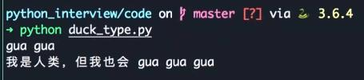

# 

## 什么是鸭子类型

** 鸭子类型（Duck Typing）是一种动态类型的编程概念，指使用一个对象的实际属性和方法来判断其类型，而不是依赖于明确的类型定义。这种概念可以让程序更加灵活，因为它允许不同类型的对象通过共享相同的属性和方法而完成相同的操作。鸭子类型的名字来自于“走起来像鸭子、叫起来像鸭子”的说法，即如果一个对象看起来像一只鸭子，走起路来也像鸭子，那么它就应该被视为一只鸭子。 **

- 关注点在对象的行为，而不是类型（duck typing）
- 比如 file，StringIO，socket 对象都支持read／write方法（file like object)
- 再比如定义了＿iter＿魔术方法的对象可以用for迭代

```python
class Duck:
  def quack(self):
    print("gua gua")


class Person:
  def quack(self):
    print(＂我是人类，但我也会 gua gua gua＂)


def in_the_forest(duck):
  duck.quack()


def game():
  donald=Duck()
  john=Person()
  in_the_forest(donald)
  in_the_forest(john)


game()
```




## 什么是monkey patch

** 什么是monkey patch？哪些地方用到了？自己如何实现？**

monkey patch是指在运行时修改已有代码的技术。这种技术可以在不修改原始代码的情况下，实现对代码的扩展和修复，甚至可以用来替换掉不好用或有缺陷的第三方库的某些方法。

在Python中，monkey patch广泛应用于测试和调试场景中。在测试中，可以用monkey patch来mock掉一些方法或数据，以便测试特定的代码路径、异常情况或部分逻辑；在调试中，可以用monkey patch来临时修改某个函数或方法，以便跟踪代码执行过程中的问题。

自己实现monkey patch可以按以下步骤进行：

1. 导入某个需要修改的模块或函数；

2. 对其需要修改的方法或属性进行重写或替换；

3. 执行修改后的代码；

4. 修改结束后恢复原有的方法或属性，以防止对其他代码造成影响。

例如，下面的代码演示了如何在运行时monkey patch一个函数：

```python
from module import function_to_patch

def new_function(*args, **kwargs):
    # 定义一个新的函数，处理原函数无法解决的逻辑
    pass

# monkey patch原函数
function_to_patch = new_function

# 执行代码
...
```

这里的模块`module`中有一个`function_to_patch`函数，需要被修改。我们定义了一个新的函数`new_function`，并将其赋值给`function_to_patch`变量，从而实现了对原函数的重写。当执行代码时，调用`function_to_patch`时，实际上执行的是我们新定义的函数`new_function`。


## 什么是自省

** Introspection **

- Python自省是指Python解释器在运行时能够查询对象的各种信息，包括类型、属性、方法、模块、函数等等。Python自省使得开发者可以动态地检查代码并用这些信息进行调试和优化

- Python自省的一些常用函数和方法包括：type()，dir()，vars()，help()，getattr()，setattr()，hasattr(), id(), isinstance()等等。这些函数和方法可以用来查询对象的各种信息，比如对象的类型、对象的属性和方法、模块的变量和函数等等。同时，Python还有一些特殊方法（比如__class__、__dict__、__dir__等等）可以用于自省

- Inspect 模块提供了更多获取对象信息的函数


## 什么是列表和字典推导

** List Comprehension **

- 列表推导是一种使用一行代码快速生成新列表的方法。它的基本语法如下：

```
[expression for item in iterable if condition]
```

其中，expression是用于生成新列表元素的表达式，item是从可迭代对象中取出的元素，可迭代对象可以是列表、元组、集合、字典等，if condition是选择性的条件语句。列表推导中的if语句可以省略。

例如，以下代码可以从原列表中筛选出大于10的元素，并生成新列表：

```
numbers = [1, 5, 11, 7, 9, 8, 15]
new_numbers = [num for num in numbers if num > 10]
print(new_numbers)

(i for i in range(10) if i％2 == 0)  # 返回生成器
```

输出：

```
[11, 15]
```

- 字典推导与列表推导类似，只是使用花括号{}来生成新字典。它的基本语法如下：

```
{key_expression: value_expression for item in iterable if condition}
```

其中，key_expression和value_expression是用于生成新字典键值对的表达式。如果不需要生成值，也可以省略value_expression。其他参数和列表推导相同。

```
a = ['a', 'b', 'c']
b = [1, 2, 3]

d = {k: v for k, v in zip(a, b)}
print(d)
```

输出：

```
{'a': 1, 'b': 2, 'c': 3}
```


## python3相对python2的改进

1. 语法：Python3 的语法更加简洁，具有更好的可读性和可维护性。

2. 打印：在Python2中，使用print语句打印输出，而在Python3中使用print()函数。

3. 整数运算：Python2中整数运算返回整数，而Python3中整数运算返回浮点数。

4. 字符串编码：Python2默认使用ASCII编码，而Python3默认使用UTF-8编码。

5. 除法：Python2中，整数之间的除法结果将会向下取整，而在Python3中，整数之间的除法结果将会是浮点数。

6. range函数：Python2中的range函数返回一个列表，而Python3中的range函数返回一个可迭代对象。

7. 异常处理：Python2中使用except Exception, e的语法来捕获异常，而Python3中使用except Exception as e的语法。

8. 类型注解(type hint) 。帮助IDE实现类型检查

9. 优化的super() 方便直接调用父类函数

10. 高级解包操作。a, b, *rest = range(10)
```python
super(C, self).hello()  #py2
super().hello()  # py3
```

总的来说，Python3相对于Python2来说更新了很多内容和语法，更加简洁、易读、易用。但是Python 2仍然广泛使用，在某些场景下仍然有很高的价值。
