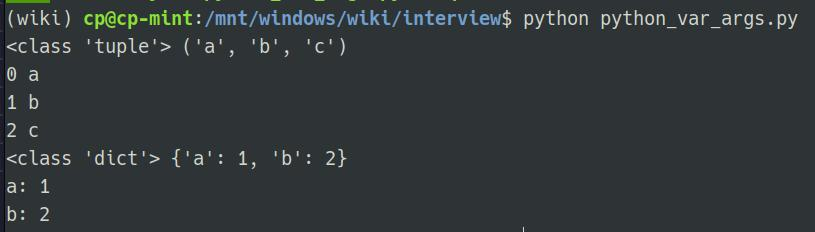
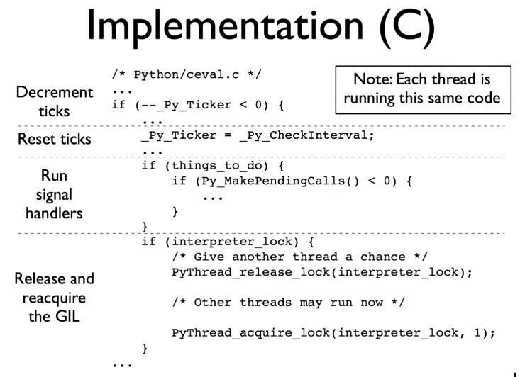
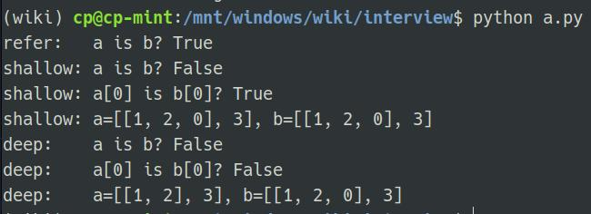

# 

## 什么是鸭子类型

** 鸭子类型(Duck Typing)是一种动态类型的编程概念，指使用一个对象的实际属性和方法来判断其类型，而不是依赖于明确的类型定义。这种概念可以让程序更加灵活，因为它允许不同类型的对象通过共享相同的属性和方法而完成相同的操作。鸭子类型的名字来自于“走起来像鸭子、叫起来像鸭子”的说法，即如果一个对象看起来像一只鸭子，走起路来也像鸭子，那么它就应该被视为一只鸭子。 **

- 关注点在对象的行为，而不是类型(duck typing)
- 比如 file，StringIO，socket 对象都支持read／write方法(file like object)
- 再比如定义了＿iter＿魔术方法的对象可以用for迭代

```python
class Duck:
  def quack(self):
    print("gua gua")


class Person:
  def quack(self):
    print(＂我是人类，但我也会 gua gua gua＂)


def in_the_forest(duck):
  duck.quack()


def game():
  donald=Duck()
  john=Person()
  in_the_forest(donald)
  in_the_forest(john)


game()
```


## 什么是monkey patch

** 什么是monkey patch？哪些地方用到了？自己如何实现？**

monkey patch是指在运行时修改已有代码的技术。这种技术可以在不修改原始代码的情况下，实现对代码的扩展和修复，甚至可以用来替换掉不好用或有缺陷的第三方库的某些方法。

在Python中，monkey patch广泛应用于测试和调试场景中。在测试中，可以用monkey patch来mock掉一些方法或数据，以便测试特定的代码路径、异常情况或部分逻辑；在调试中，可以用monkey patch来临时修改某个函数或方法，以便跟踪代码执行过程中的问题。

自己实现monkey patch可以按以下步骤进行：

1. 导入某个需要修改的模块或函数；

2. 对其需要修改的方法或属性进行重写或替换；

3. 执行修改后的代码；

4. 修改结束后恢复原有的方法或属性，以防止对其他代码造成影响。

例如，下面的代码演示了如何在运行时monkey patch一个函数：

```python
from module import function_to_patch

def new_function(*args, **kwargs):
    # 定义一个新的函数，处理原函数无法解决的逻辑
    pass

# monkey patch原函数
function_to_patch = new_function

# 执行代码
...
```

这里的模块`module`中有一个`function_to_patch`函数，需要被修改。我们定义了一个新的函数`new_function`，并将其赋值给`function_to_patch`变量，从而实现了对原函数的重写。当执行代码时，调用`function_to_patch`时，实际上执行的是我们新定义的函数`new_function`。


## 什么是自省

** Introspection **

- Python自省是指Python解释器在运行时能够查询对象的各种信息，包括类型、属性、方法、模块、函数等等。Python自省使得开发者可以动态地检查代码并用这些信息进行调试和优化

- Python自省的一些常用函数和方法包括：type()，dir()，vars()，help()，getattr()，setattr()，hasattr(), id(), isinstance()等等。这些函数和方法可以用来查询对象的各种信息，比如对象的类型、对象的属性和方法、模块的变量和函数等等。同时，Python还有一些特殊方法(比如__class__、__dict__、__dir__等等)可以用于自省

- Inspect 模块提供了更多获取对象信息的函数


## 什么是列表和字典推导

** List Comprehension **

- 列表推导是一种使用一行代码快速生成新列表的方法。它的基本语法如下：

```
[expression for item in iterable if condition]
```

其中，expression是用于生成新列表元素的表达式，item是从可迭代对象中取出的元素，可迭代对象可以是列表、元组、集合、字典等，if condition是选择性的条件语句。列表推导中的if语句可以省略。

例如，以下代码可以从原列表中筛选出大于10的元素，并生成新列表：

```
numbers = [1, 5, 11, 7, 9, 8, 15]
new_numbers = [num for num in numbers if num > 10]
print(new_numbers)

(i for i in range(10) if i％2 == 0)  # 返回生成器
```

输出：

```
[11, 15]
```

- 字典推导与列表推导类似，只是使用花括号{}来生成新字典。它的基本语法如下：

```
{key_expression: value_expression for item in iterable if condition}
```

其中，key_expression和value_expression是用于生成新字典键值对的表达式。如果不需要生成值，也可以省略value_expression。其他参数和列表推导相同。

```
a = ['a', 'b', 'c']
b = [1, 2, 3]

d = {k: v for k, v in zip(a, b)}
print(d)
```

输出：

```
{'a': 1, 'b': 2, 'c': 3}
```


## python3改进

1. 语法：Python3 的语法更加简洁，具有更好的可读性和可维护性。

2. 打印：在Python2中，使用print语句打印输出，而在Python3中使用print()函数。

3. 整数运算：Python2中整数运算返回整数，而Python3中整数运算返回浮点数。

4. 字符串编码：Python2默认使用ASCII编码，而Python3默认使用UTF-8编码。

5. 除法：Python2中，整数之间的除法结果将会向下取整，而在Python3中，整数之间的除法结果将会是浮点数。

6. range函数：Python2中的range函数返回一个列表，而Python3中的range函数返回一个可迭代对象。

7. 异常处理：Python2中使用except Exception, e的语法来捕获异常，而Python3中使用except Exception as e的语法。

8. 类型注解(type hint): 帮助IDE实现类型检查

9. 优化的super(): 方便直接调用父类函数
`super(C, self).hello()  #py2 super().hello()  # py3`

10. 高级解包操作: a, b, *rest = range(10)

11. 限定关键字参数(Keyword only arguments): **表示限制关键字参数

12. 异常链: Python3通过raise from 将原始异常和新异常一起抛出

13. 一切返回迭代器: range, zip, map, dict.values...

14. yield from 链接子生成器

15. asyncio内置库，async／await 原生协程支持异步编程

16. 新的内置库 enum，mock，asyncio，ipaddress，concurrent.futures 等

17. 生成的pyc文件统一放到__pycache__

18. 一些内置库的修改。urllib, selector等

总的来说，Python3相对于Python2来说更新了很多内容和语法，更加简洁、易读、易用。但是Python 2仍然广泛使用，在某些场景下仍然有很高的价值。


## 函数相关
### python如何传递参数

- 传递值还是引用？都不是。唯一支持的参数传递是共享传参
- 共享传参(Call by sharing): 函数形参获得实参中各个引用的副本


### python可变/不可变对象

- 不可变对象: bool/int/float/tuple/str/frozenset
- 可变对象: list/set/dict


### python函数传递中*args和**kwargs

- 用来处理可变参数
- *args被打包成tuple
- **kwargs被打包成dict

```python
def print_multiple_args(*args):
    print(type(args), args)
    for idx, val in enumerate(args):
        print(idx, val)


def print_kwargs(**kwargs):
    print(type(kwargs), kwargs)
    for k, v in kwargs.items():
        print('{}: {}'.format(k, v))


print_multiple_args('a', 'b', 'c')
print_multiple_args(*['a', 'b', 'c'])
print_kwargs(a=1, b=2)
print_kwargs(**dict(a=1, b=2))
```
 


## GIL(全局解释器锁)
### 什么是Cpython GIL

- GIL: Global Interpreter Lock
- Cpython解释器的内存管理并不是线程安全的
- 保护多线程情况下对Python对象的访问，Cpython使用简单的锁机制避免多个线程同时执行字节码


### GIL的影响

**限制了程序的多核执行**

- 同一时间只能有一个线程执行字节码
- CPU密集程序难以利用多核优势
- IO期间会释放GIL,对IO密集程序影响不大


### 如何规避GIL影响

**区分CPU和IO密集程序**

- CPU密集: 多进程 + 进程池
- IO密集: 多线程/协程
- cython扩展


### GIL的实现

 

### 为什么有了GIL还要关注线程安全

**Python中什么操作才是原子的？一步到位执行完**

- 一个操作如果是一个字节码指令可以完成就是原子的
- 原子的是可以保证线程安全的，因为同一时刻只能有一个线程执行同一个字节码
- 使用dis操作来分析字节码


## 性能分析

### 分析工具

- 内置的profile/cprofile工具分析
- web应用: 使用pyflame(uber开源)的火焰图工具

### 服务端性能优化措施

**web应用一般语言不会成为瓶颈**

- 数据结构与算法优化
- 数据库层: 索引优化，消除慢查询，批量操作减少IO，NoSQL
- 网络IO: 批量操作/pipeline操作减少IO
- 缓存: 使用内存数据库 redis/memcache
- 异步: asyncio, celery
- 并发: gevent/多线程


## 生成器&协程

### 生成器(generator)

- 生成器就是可以生成值的函数
- 当一个函数里有了yield关键字就成了生成器
- 生成器可以挂起执行并且保持当前执行的状态

```python
def simple_gen():
    yield "hello"
    yield "world"


gen = simple_gen()
print(type(gen))  # 'generator' object
print(next(gen))  # 'hello'
print(next(gen))  # 'world'
```

### 基于生成器的协程
**python3之前没有原生协程，只有基于生成器的协程**

- pep342增强生成器功能
- 生成器可以通过yield暂停执行和产出数据
- 同时支持send()向生成器发送数据和throw()向生成器抛出异常

```python
def coro():
    hello = yield 'hello'  # yield关键字在=右边作为表达式，可以被send值
    yield hello


c = coro()
# 输出hello,这里调用next产出第一个值hello，之后函数暂停
print(next(c))
# 再次调用send发送值,此时hello变量赋值为'world',然后yield产出hello变量的值'world'
print(c.send('world'))
# 之后协程结束，后续再send值会抛出异常StopIteration
```

### 协程注意点
- 协程需要使用send(None)或者next(coroutine)来预激(prime)才能启动
- 在yield处协程会暂停执行
- 单独的yield value会产出值给调用方
- 可以通过coroutine.send(value)来给协程发送值，发送的值会赋值给yield表达式左边的变量
- 协程执行完成后(没有遇到下一个yield语句)会抛出StopIteration异常

### 协程装饰器
**避免每次都要send预激它**
```python
from functools import wraps


def coroutine(func):  # 这样就不用每次都send(None)启动了
    """装饰器:向前执行到第一个yield表达式，预激func"""
    @wraps(func)
    def primer(*args, **kwargs):
        gen = func(*args, **kwargs)
        next(gen)
        return gen
    return primer
```

### python3.5之后的原生协程
**python3.5引入async/await支持原生协程(native coroutine)**
```python
import asyncio
import datetime
import random


async def display_date(num, loop):
    end_time = loop.time() + 50.0
    while True:
        print('Loop: {} Time: {}'.format(num, datetime.datetime.now()))
        if (loop.time()+1.0) >= end_time:
            break
        await asyncio.sleep(random.randint(0, 5))


loop = asyncio.get_event_loop()
asyncio.ensure_future(display_date(1, loop))
asyncio.ensure_future(display_date(2, loop))
loop.run_forever()
```


## 深拷贝vs浅拷贝

### 什么是深拷贝、浅拷贝
- 浅拷贝: 重新分配一块内存，创建一个新的对象，但里面的元素是原对象中各个子对象的引用
- 深拷贝: 重新分配一块内存，创建一个新的对象，且里面的元素也是以递归的方式创建新的子对象并拷贝到新对象中
- 引用:   变量的赋值

### python中如何实现深拷贝
**通过deep.deepcopy()**

```python
import copy


def refer():
    """对象引用"""
    a = [[1, 2], 3]
    b = a
    print("refer:   a is b? {}".format(a is b))


def shallow_copy():
    """浅拷贝"""
    a = [[1, 2], 3]
    b = copy.copy(a)
    print("shallow: a is b? {}".format(a is b))
    print("shallow: a[0] is b[0]? {}".format(a[0] is b[0]))
    b[0].append(0)
    print("shallow: a={}, b={}".format(a, b))


def deep_copy():
    """深拷贝"""
    a = [[1, 2], 3]
    b = copy.deepcopy(a)
    print("deep:    a is b? {}".format(a is b))
    print("deep:    a[0] is b[0]? {}".format(a[0] is b[0]))
    b[0].append(0)
    print("deep:    a={}, b={}".format(a, b))


refer()
shallow_copy()
deep_copy()
```
 

### python中如何正确初始化一个二维数组

***方式二实际上并不是创建了一个新的二维数组，而是创建了三个指向array的引用***
```python
# 方式一: 列表推导式方式
n, m = 3, 4
a = [[0 for _ in range(m)] for i in range(n)]
print(a)
a[0][0] = 1
print(a)
for i in range(n):
    print("第{}个元素的地址是: {}".format(i, id(a[i])))
print()


# 方式二
array = [0 for _ in range(m)]
matrix = [array] * n
print(matrix)
matrix[0][0] = 1
print(matrix)
for i in range(n):
    print("第{}个元素的地址是: {}".format(i, id(matrix[i])))
```
 


## 数据结构与算法
pass


## 面向对象

### 组合与继承
**优先使用组合而非继承**

- 组合是使用其他的类实例作为自己的一个属性(Has-a关系)
- 子类继承父类的属性和方法(Is-a关系)
- 优先使用组合保持代码简单

### 类变量和实例变量
- 类变量由所有实例共享
- 实例变量由实例单独享有，不同实例之间不影响
- 当我们需要在一个类的不同实例之间共享变量的时候使用类变量

### classmethod vs staticmethod
- 都可以使用Class.method()的方式使用
- classmethod第一个参数是cls,可以引用类变量
- staticmethod使用起来和普通函数一样，只不过放在类里去组织

### 元类
**元类(Meta Class)是创建类的类**

- 元类允许我们控制类的生成，比如修改类的属性等
- 使用type来定义元类
- 元类最常见的一个使用场景就是ORM框架

