#

## Linux 安装

### 1. 下载安装包

`wget https://mirrors.huaweicloud.com/redis/redis-6.0.6.tar.gz`

### 2. 解压 redis 安装包

`tar -zxvf /home/sniper/redis-6.0.6.tar.gz -d /opt`

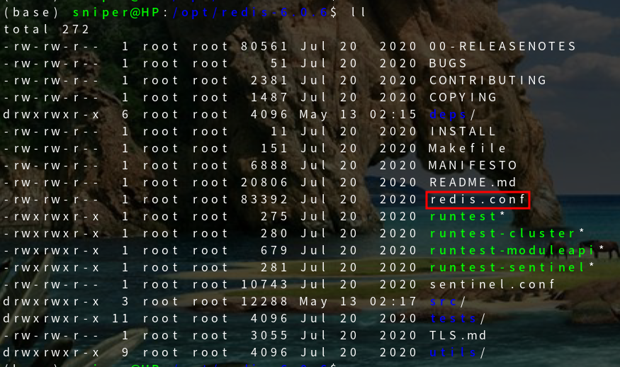

### 3. 安装

```bash
# 安装 gcc:
yum install gcc-c++
# 预编译
make
# 创建 redis 安装目录
mkdir -p /usr/local/redis
# 安装
make PREFIX=/usr/local/redis/ install
```

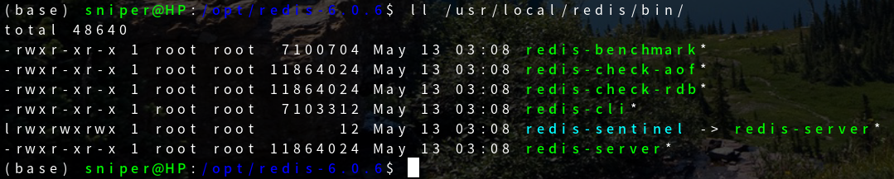

### 4. 启动

```bash
# 默认是前台启动
/usr/local/redis/bin/redis-server
# 修改redis.conf, 后台启动
cp /opt/redis-6.0.6/redis.conf /usr/local/redis/bin/
sed -i 's/daemonize no/daemonize yes/g' redis.conf
./redis-server ./redis.conf
```

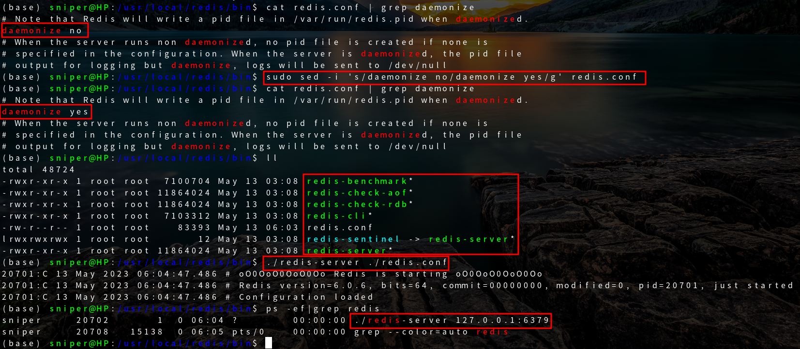

### 5. 使用 redis-cli 进行连接测试

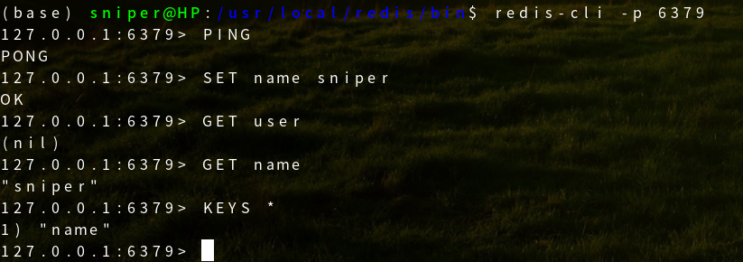

## Redis 主从复制

### 概念

主从复制，是指将一台 Redis 服务器的数据，复制到其他的 Redis 服务器。前者称为主节点（master／leader），后者称为从节点（slave／follower）；<mark> 数据的复制是单向的，只能由主节点到从节点。</mark> Master 以写为主，Slave 以读为主。

<mark>默认情况下，每台 Redis 服务器都是主节点；</mark>且一个主节点可以有多个从节点（或没有从节点），但一个从节点只能有一个主节点。

### 主从复制的作用

1. 数据冗余：主从复制实现了数据的热备份，是持久化之外的一种数据冗余方式。

2. 故障恢复：当主节点出现问题时，可以由从节点提供服务，实现快速的故障恢复；实际上是一种服务的冗余。

3. 负载均衡：在主从复制的基础上，配合读写分离，可以由主节点提供写服务，由从节点提供读服务（即写 Redis 数据时应用连接主节点，读 Redis 数据时应用连接从节点），分担服务器负载；尤其是在写少读多的场景下，通过多个从节点分担读负载，可以大大提高 Redis 服务器的并发量。

4. 高可用(集群)基石：除了上述作用以外，主从复制还是哨兵和集群能够实施的基础，因此说主从复制是 Redis 高可用的基础。

### 为什么使用主从复制

一般来说，要将 Redis 运用于工程项目中，只使用一台 Redis 是万万不能的(宕机, 最低就是 1 主 2 从)，原因如下：

1、从结构上，单个 Redis 服务器会发生单点故障，并且一台服务器需要处理所有的请求负载，压力较大；

2、从容量上，单个 Redis 服务器内存容量有限，就算一台 Redis 服务器内存容量为 256G，也不能将所有内存用作 Redis 存储内存，一般来说，<mark>单台 Redis 最大使用内存不应该超过 20G。</mark>

### 环境配置

只配置从库，不用配置主库，因为<mark>默认情况下，每台 Redis 服务器都是主库</mark>

```bash
127.0.0.1:6379> INFO replication  # 查看当前库的信息
# Replication
role:master  # 角色 master
connected_slaves:0  # 没有从机
master_replid:74ddc05e1ca9518ff9d6ebe0ca8b6847dc9a7ac8
master_replid2:0000000000000000000000000000000000000000
master_repl_offset:0
second_repl_offset:-1
repl_backlog_active:0
repl_backlog_size:1048576
repl_backlog_first_byte_offset:0
repl_backlog_histlen:0
```

复制 3 个配置文件，然后修改对应的配置信息

```
1、端口
2、pid 名字
3、log 文件名字
4、dump.rdb 名字
```

修改完毕后，启动 3 个 redis 服务器，可以通过进程信息查看

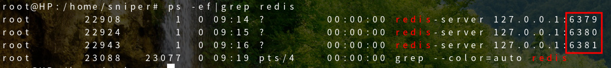

### 一主二从

#### 架构图

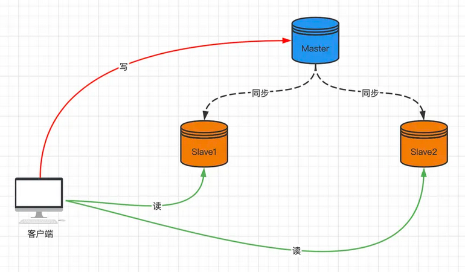

#### 命令方式配置

<mark>默认情况下，每台 Redis 服务器都是主节点</mark> 我们一般情况下只用配置从机就好了

认老大！一主(79)二从(80, 81)

```bash
127.0.0.1:6380> SLAVEOF 127.0.0.1 6379  # 找谁当自己的老大
OK
127.0.0.1:6380> INFO replication
# Replication
role:slave  # 当前的角色是从机
master_host:127.0.0.1  # 可以看到主机的信息
master_port:6379
master_link_status:up
master_last_io_seconds_ago:2
master_sync_in_progress:0
slave_repl_offset:14
slave_priority:100
slave_read_only:1
connected_slaves:0
master_replid:b640f011ab5aa554dd6ab270e8acfe49dca524f3
master_replid2:0000000000000000000000000000000000000000
master_repl_offset:14
second_repl_offset:-1
repl_backlog_active:1
repl_backlog_size:1048576
repl_backlog_first_byte_offset:1
repl_backlog_histlen:14

# 在主机中查看
127.0.0.1:6379> INFO replication
# Replication
role:master
connected_slaves:1  # 多了从机的配置信息
slave0:ip=127.0.0.1,port=6380,state=online,offset=56,lag=1  # 多了从机信息
master_replid:b640f011ab5aa554dd6ab270e8acfe49dca524f3
master_replid2:0000000000000000000000000000000000000000
master_repl_offset:56
second_repl_offset:-1
repl_backlog_active:1
repl_backlog_size:1048576
repl_backlog_first_byte_offset:1
repl_backlog_histlen:56
```

如果两个都配置完了，就是有两个从机的信息
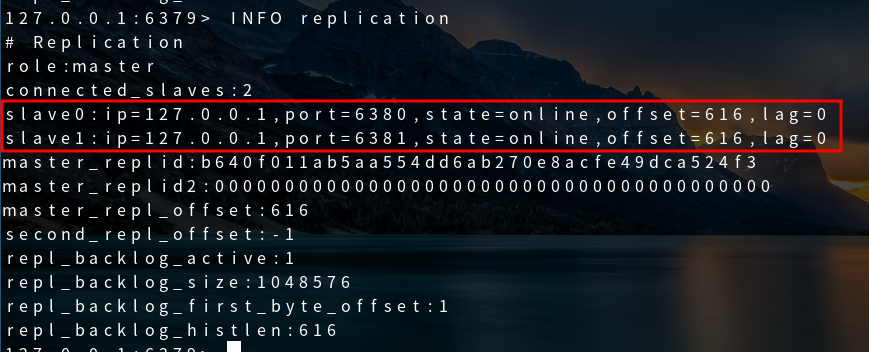

#### 配置文件方式配置

真实的主从配置应该在配置文件中配置，这样是永久的;我们这里使用的是命令配置，是暂时的！

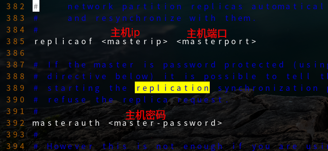

#### 具体细节

1、主机可以写，从机不能写只能读！主机中的所有信息和数据，都会自动被从机保存

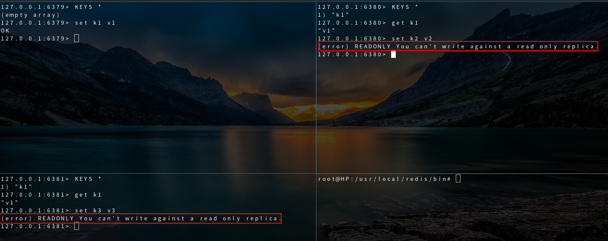

2、主机断开连接，从机依旧连接到主机的，但是没有写操作; 如果主机重新连接了，从机依旧可以直接获取到主机写的信息！


3、使用命令方式配置主从，如果从机重启了，就会断开与主机的主从关系; 只要重新配置成从机，立马就会同步到主机的数据

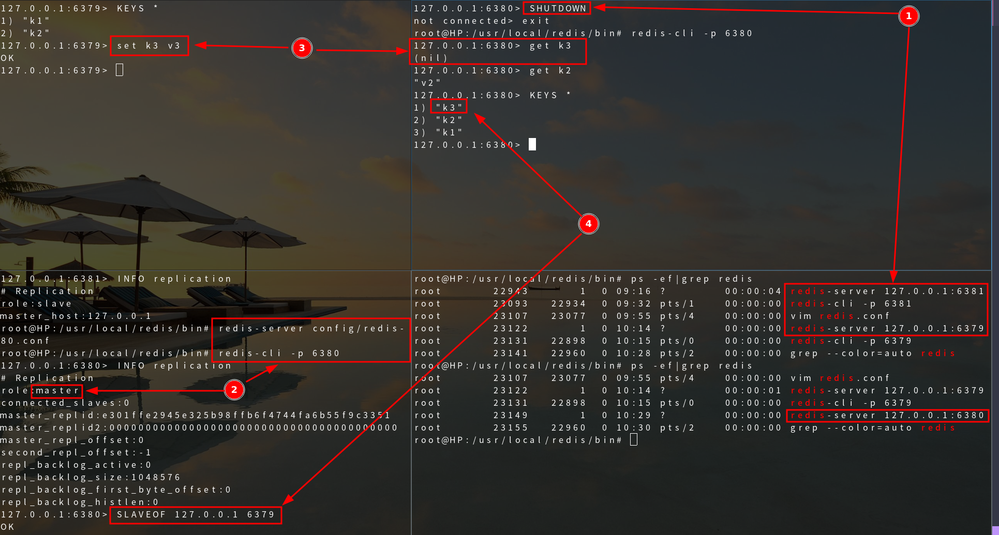

#### 复制原理

Slave 启动成功连接到 master 后会发送一个 sync 同步命令

Master 接到命令，启动后台的存盘进程，同时收集所有接收到的用于修改数据集命令，在后台进程执行完毕之后，<mark>master 将传送整个数据文件到 slave，并完成一次完全同步。</mark>

<mark>全量复制：</mark> 而 Tslave 服务在接收到数据库文件数据后，将其存盘并加载到内存中。

<mark>增量复制：</mark> Master 继续将新的所有收集到的修改命令依次传给 slave，完成同步

但是只要是重新连接 master，一次完全同步（全量复制）将被自动执行！我们的数据一定可以在从机中看到！

### 层层链路

上一个 master 链接下一个 slave

#### 架构图

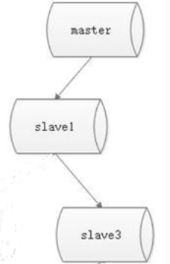
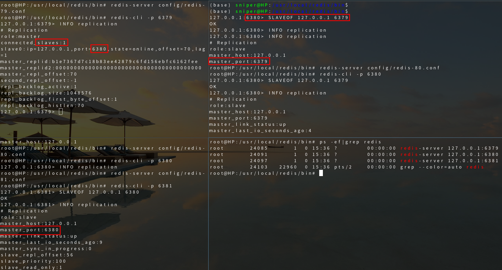

### 哨兵模式-自动选举

#### 手动选举

- 如果没有老大(master)了，能不能选择一个新的出来？需要手动修改
- 使用命令 `SLAVEOF no one` 让自己变成主机！其他节点可以手动连接到最新的这个主机;即使原老大(master)重新启动了，也不会恢复到原来的主从关系

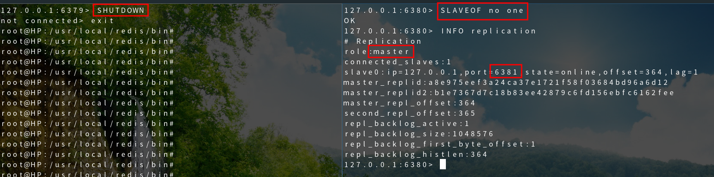

#### 哨兵模式

主从切换技术的方法是：当主服务器宕机后，需要手动把一台从服务器切换为主服务器，这就需要人工干预，费事费力，还会造成一段时间内服务不可用。这不是一种推荐的方式，更多时候，我们优先考虑哨兵模式。Redis 从 2.8 开始正式提供了 Sentinel （哨兵）架构来解决这个问题。

谋朝篡位的自动版，能够后台监控主机是否故障，如果故障了根据投票数<mark>自动将从库转换为主库。</mark>

哨兵模式是一种特殊的模式，首先 Redis 提供了哨兵的命令，哨兵是一个独立的进程，作为进程，它会独立运行。其原理是<mark>哨兵通过发送命令，等待 Redis 服务器响应，从而监控运行的多个 Redis 实例。</mark>

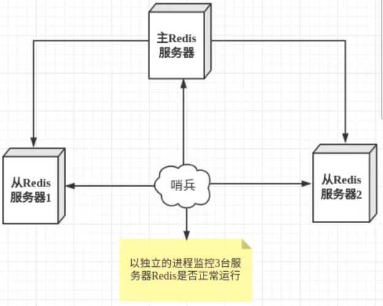

这里的哨兵有两个作用

- 通过发送命令，让 Redis 服务器返回监控其运行状态，包括主服务器和从服务器。
- 当哨兵监测到 master 宕机，会自动将 slave 切换成 master，然后通过<mark>发布订阅模式</mark>通知其他的从服务器，修改配置文件，让它们切换主机。

然而一个哨兵进程对 Redis 服务器进行监控，可能会出现问题，为此，我们可以使用多个哨兵进行监控。各个哨兵之间还会进行监控，这样就形成了多哨兵模式。

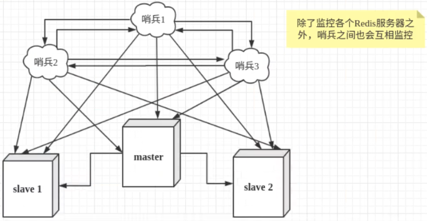

假设主服务器宕机，哨兵 1 先检测到这个结果，系统并不会马上进行 failover 过程，仅仅是哨兵 1 主观的认为主服务器不可用，这个现象成为<mark>主观下线</mark>。当后面的哨兵也检测到主服务器不可用，并且数量达到一定值时，那么哨兵之间就会进行一次投票，投票的结果由一个哨兵发起，进行 failover［故障转移］操作。切换成功后，就会通过发布订阅模式，让各个哨兵把自己监控的从服务器实现切换主机，这个过程称为<mark>客观下线。</mark>

#### 配置哨兵

当前 redis 集群状态：一主二从

1、简单配置哨兵配置文件 sentinel.conf

```bash
touch /usr/local/redis/bin/config/sentinel.conf
# sentinel monitor 被监控的名称 host port 配置多少个sentinel哨兵统一认为master主节点失联,那么这时客观上认为主节点失联了
echo 'sentinel monitor myredis 127.0.0.1 6379 1' >> /usr/local/redis/bin/config/sentinel.conf
```

2、哨兵模式的全部配置

```bash
# 哨兵sentinel实例题行的端口默认26379
# 如果有哨兵集群，我们需要配置每个哨兵端口
port 26379

# 哨兵sentinel的工作目录
dir /tmp

# 哨兵sentinel监控的redis主节点的 ip port
# master-name 可以自己命名的主节点名字只能由字母A-z、数字0-9、这三个字符".-_"组成。
# quorum 配置多少个sentinel哨兵统一认为master主节点失联,那么这时客观上认为主节点失联了
# sentinel monitor <master-name> <ip> <redis-port> <quorum>
sentinel monitor mymaster 127.0.0.1 6379 2

# 当在Redis实中开启了requirepass foobared授权密码 这样所有连接Redis实例的客户端都要提供密码
# 设置哨兵sentinel连接主从的密码 注意必须为主从设置一样的验证密码
# sentinel auth-pass <master-name> <password>
sentinel auth-pass mymaster MySUPER--secret-0123passw0rd

# 指定多少毫秒之后 主节点没有应答哨兵sentinel 此时哨兵主观上认为主节点下线 默认30秒
# sentinel down-after-mi1liseconds <master-name> <mi11iseconds>
sentinel down-after-mi11iseconds mymaster 30000

# 这个配置项指定了在发生failover主备切换时最多可以有多少个s1ave同时对新的master进行同步，
# 这个数字越小， 完成failover所需的时间就越长，
# 但是如果这个数字越大， 就意味着越多的s1ave因为rep1ication而不可用。
# 可以通过将这个值设为 1 来保证每次只有一个slave处于不能处理命令请求的状态。
# sentinel parallel-syncs <master-name> <nums1aves>
sentinel parallel-syncs mymaster 1

# 故障转移的超时时间failover-timeout可以用在以下这些方面：
# 1.同一个sentinel对同一个master两次failover之间的间隔时间。
# 2.当一个slave从一个错误的master那里同步数据开始计算时间。直到slave被纠正为向正确的master那里同步数据时。
# 3.当想要取消一个正在进行的failover所需要的时间。
# 4.当进行failover时， 配置所有slaves指向新的master所需的最大时间。不过， 即使过了这个超时， s1aves依然会被正确配置为指向
# master， 但是就不按parallel-syncs所配置的规则来了
# 默认三分钟
# sentinel failover-timeout <master-name> <mi11iseconds>
sentinel failover-timeout mymaster 180000

# SCRIPTS EXECUTION

# 配置当某一事件发生时所需要执行的脚本，可以通过脚木来通知管理员，例如当系统运行不正常时发邮件通知相关人员
# 对于脚本的运行结果有以下规则：
# 若脚本执行后返回1，那么该脚本稍后将会被再次执行，重复次数目前默认为10
# 若脚本执行后返回2，或者比2更高的一个返回值，脚本将不会重复执行。
# 如果脚本在执行过程中由于收到系统中断信号被终止了，则同返回值为1时的行为相同。
# 一个脚本的最大执行时间为60s， 如果超过这个时间， 脚本将会被一个SIGKILL信号终止， 之后重新执行

# 通知型脚本：当sentinel有任何警告级别的事件发生时(比如说redis实例的主观失效和客观失效等等) ， 将会去调用这个脚本， 这时这个
# 脚本应该通过邮件， SMS等方式去通知系统管理员关于系统不正常运行的信息。调用该脚本时， 将传给脚本两个参数， 一个是事件的类型， 一
# 个是事件的描述。如果sentinel.conf配置文件中配置了这个脚本路径， 那么必须保证这个脚本存在于这个路径， 并且是可执行的， 否则
# sentinel无法正常启动成功。
# 通知脚本
# shell编程
# sentinel notification-script <master-name> <script-path>
sentinel notification-script mymaster /var/redis/notify.sh

# 客户端重新配置主节点参数脚本
# 当一个master由于failover而发生改变时， 这个脚本将会被调用， 通知相关的客户端关于master地址已经发生改变的信息。
# 以下参数将会在调用脚本时传给脚本：
# <master-name> <ro1e> <state> <from-ip> <from-port> <to-ip> <to-port>
# 目前<state>总是“failover”，
# <ro1e>是“leader”或者“observer”中的一个。
# 参数from-ip，from-port， to-ip， to-port是用来和旧的master和新的master(即旧的s1ave) 通信的
# 这个脚本应该是通用的，能被多次调用，不是针对性的。
# sentinel client-reconfig-script <master-name> <script-path>
sentinel c1ient-reconfig-script mymaster /var/redis/reconfig.sh
```

#### 启动哨兵

````bash
root@HP:/usr/local/redis/bin# redis-sentinel config/sentinel.conf
24958:X 14 May 2023 02:44:49.211 # oO0OoO0OoO0Oo Redis is starting oO0OoO0OoO0Oo
24958:X 14 May 2023 02:44:49.211 # Redis version=6.0.6, bits=64, commit=00000000, modified=0, pid=24958, just started
24958:X 14 May 2023 02:44:49.211 # Configuration loaded
24958:X 14 May 2023 02:44:49.212 * Increased maximum number of open files to 10032 (it was originally set to 1024).
                _._
           _.-``__ ''-._
      _.-``    `.  `_.  ''-._           Redis 6.0.6 (00000000/0) 64 bit
  .-`` .-```.  ```\/    _.,_ ''-._
 (    '      ,       .-`  | `,    )     Running in sentinel mode
 |`-._`-...-` __...-.``-._|'` _.-'|     Port: 26379
 |    `-._   `._    /     _.-'    |     PID: 24958
  `-._    `-._  `-./  _.-'    _.-'
 |`-._`-._    `-.__.-'    _.-'_.-'|
 |    `-._`-._        _.-'_.-'    |           http://redis.io
  `-._    `-._`-.__.-'_.-'    _.-'
 |`-._`-._    `-.__.-'    _.-'_.-'|
 |    `-._`-._        _.-'_.-'    |
  `-._    `-._`-.__.-'_.-'    _.-'
      `-._    `-.__.-'    _.-'
          `-._        _.-'
              `-.__.-'

24958:X 14 May 2023 02:44:49.605 # Sentinel ID is 6b15a16349bb9efd377456e622d1b894ce689f73
24958:X 14 May 2023 02:44:49.605 # +monitor master myredis 127.0.0.1 6379 quorum 1
24958:X 14 May 2023 02:46:09.821 * +slave slave 127.0.0.1:6380 127.0.0.1 6380 @ myredis 127.0.0.1 6379
24958:X 14 May 2023 02:46:19.955 * +slave slave 127.0.0.1:6381 127.0.0.1 6381 @ myredis 127.0.0.1 637
````

#### 测试主机宕机


```bash
24958:X 14 May 2023 02:51:29.486 # +sdown master myredis 127.0.0.1 6379
24958:X 14 May 2023 02:51:29.486 # +odown master myredis 127.0.0.1 6379 #quorum 1/1
24958:X 14 May 2023 02:51:29.486 # +new-epoch 1
24958:X 14 May 2023 02:51:29.486 # +try-failover master myredis 127.0.0.1 6379
24958:X 14 May 2023 02:51:29.542 # +vote-for-leader 6b15a16349bb9efd377456e622d1b894ce689f73 1
24958:X 14 May 2023 02:51:29.542 # +elected-leader master myredis 127.0.0.1 6379
24958:X 14 May 2023 02:51:29.542 # +failover-state-select-slave master myredis 127.0.0.1 6379
24958:X 14 May 2023 02:51:29.594 # +selected-slave slave 127.0.0.1:6380 127.0.0.1 6380 @ myredis 127.0.0.1 6379
24958:X 14 May 2023 02:51:29.594 * +failover-state-send-slaveof-noone slave 127.0.0.1:6380 127.0.0.1 6380 @ myredis 127.0.0.1 6379
24958:X 14 May 2023 02:51:29.665 * +failover-state-wait-promotion slave 127.0.0.1:6380 127.0.0.1 6380 @ myredis 127.0.0.1 6379
24958:X 14 May 2023 02:51:30.008 # +promoted-slave slave 127.0.0.1:6380 127.0.0.1 6380 @ myredis 127.0.0.1 6379
24958:X 14 May 2023 02:51:30.008 # +failover-state-reconf-slaves master myredis 127.0.0.1 6379
24958:X 14 May 2023 02:51:30.044 * +slave-reconf-sent slave 127.0.0.1:6381 127.0.0.1 6381 @ myredis 127.0.0.1 6379
24958:X 14 May 2023 02:51:30.394 * +slave-reconf-inprog slave 127.0.0.1:6381 127.0.0.1 6381 @ myredis 127.0.0.1 6379
24958:X 14 May 2023 02:51:30.394 * +slave-reconf-done slave 127.0.0.1:6381 127.0.0.1 6381 @ myredis 127.0.0.1 6379
24958:X 14 May 2023 02:51:30.465 # +failover-end master myredis 127.0.0.1 6379
24958:X 14 May 2023 02:51:30.465 # +switch-master myredis 127.0.0.1 6379 127.0.0.1 6380
24958:X 14 May 2023 02:51:30.465 * +slave slave 127.0.0.1:6381 127.0.0.1 6381 @ myredis 127.0.0.1 6380
24958:X 14 May 2023 02:51:30.465 * +slave slave 127.0.0.1:6379 127.0.0.1 6379 @ myredis 127.0.0.1 6380
24958:X 14 May 2023 02:52:00.490 # +sdown slave 127.0.0.1:6379 127.0.0.1 6379 @ myredis 127.0.0.1 6380
```

- 如果 Master 主机断开了，这个时候就会从从机中随即选择一个服务器！(投票算法)

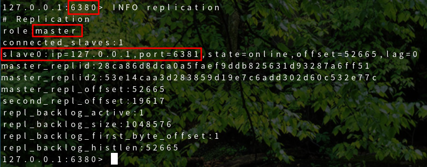

- 如果 Master 主机又重新连接，只能归并到新的主机(80)下当从机，这就是哨兵模式的规则

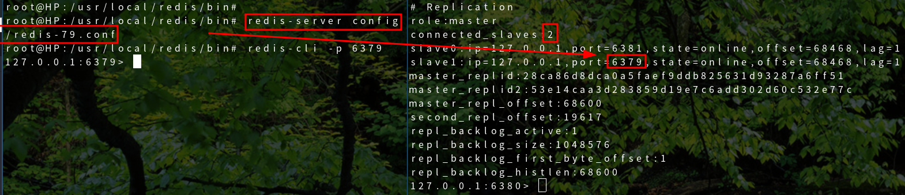

```bash
24958:X 14 May 2023 03:03:03.453 # -sdown slave 127.0.0.1:6379 127.0.0.1 6379 @ myredis 127.0.0.1 6380
24958:X 14 May 2023 03:03:13.457 * +convert-to-slave slave 127.0.0.1:6379 127.0.0.1 6379 @ myredis 127.0.0.1 638
```

#### 哨兵模式优缺点

- 优点：

```bash
1、 哨兵集群，基于主从复制模式，所有的主从配置优点，它全有
2、 主从可以切换，故障可以转移，系统的可用性就会更好
3、 哨兵模式就是主从模式的升级，手动到自动，更加健壮！
```

- 缺点：

```bash
1、Redis 不好在线扩容的，集群容量一旦到达上限，在线扩容就十分麻烦！
2、实现哨兵模式的配置其实是很麻烦的，里面有很多选择！
```

## Redis 缓存穿透、击穿和雪崩

**保证服务高可用**

Redis 缓存的使用，极大的提升了应用程序的性能和效率，特别是数据查询方面。但同时，它也带来了一些问题。其中，最要害的问题，就是数据的一致性问题，从严格意义上讲，这个问题无解。如果对数据的一致性要求很高，那么就不能使用缓存。

另外的一些典型问题就是，缓存穿透、缓存雪崩和缓存击穿。目前，业界也都有比较流行的解决方案。

### 缓存穿透(查不到)

#### 概念

缓存穿透的概念很简单，用户想要查询一个数据，发现 redis 内存数据库没有，也就是缓存没有命中，于是向持久层数据库查询。发现也没有，于是本次查询失败。当用户很多的时候，缓存都没有命中，于是都去请求了持久层数据库。这会给持久层数据库造成很大的压力，这时候就相当于出现了缓存穿透。
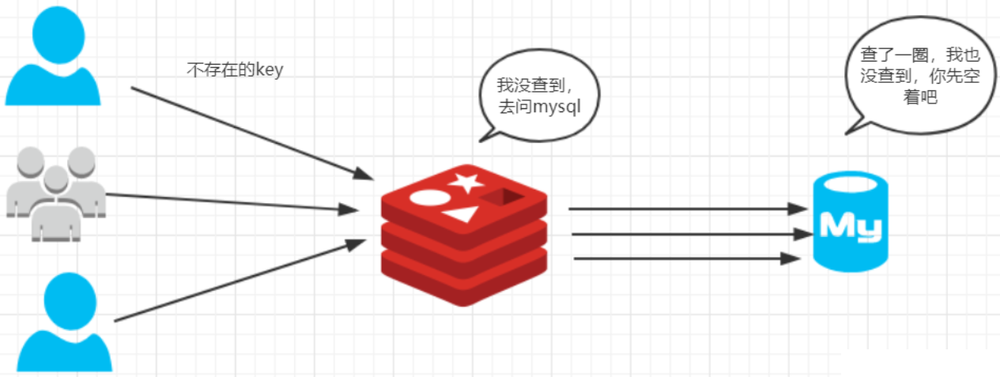

#### 解决方案

1、 布隆过滤器

布隆过滤器是一种数据结构，对所有可能查询的参数以 hash 形式存储，在控制层先进行校验，不符合则丢弃，从而避免了对底层存储系统的查询压力；

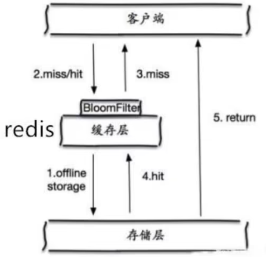

2、 缓存空对象

当存储层不命中后，即使返回的空对象也将其缓存起来，同时会设置一个过期时间，之后再访问这个数据将会从缓存中获取，保护了后端数据源;

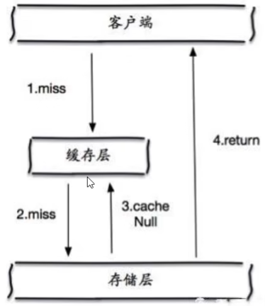

但是这种方法会存在两个问题：

1. 如果空值能够被缓存起来，这就意味着缓存需要更多的空间存储更多的键，因为这当中可能会有很多的空值的键；
2. 即使对空值设置了过期时间，还是会存在缓存层和存储层的数据会有一段时间窗口的不一致，这对于需要保持一致性的业务会有影响。

### 缓存击穿(量太大,缓存过期)

#### 概念

- 这里需要注意和缓存击穿的区别，缓存击穿，是指一个 key 非常热点，在不停的扛着大并发，大并发集中对这一个点进行访问，当这个 key 在失效的瞬间，持续的大并发就穿破缓存，直接请求数据库，就像在一个屏障上凿开了一个洞。
- 当某个 key 在过期的瞬间，有大量的请求并发访问，这类数据一般是热点数据，由于缓存过期，会同时访问数据库来查询最新数据，并且回写缓存，会导使数据库瞬间压力过大。

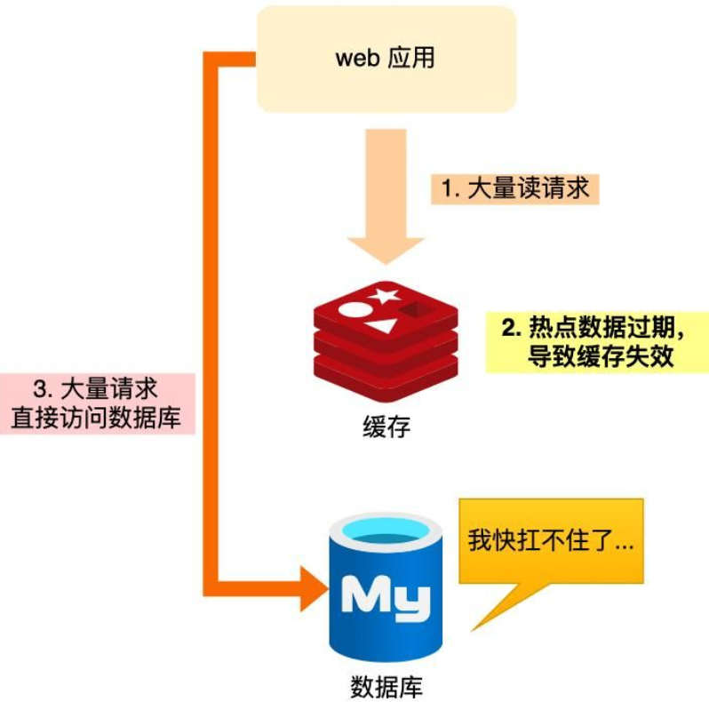

#### 解决方案

1、 设置热点数据永不过期

从缓存层面来看， 没有设置过期时间， 所以不会出现热点 key 过期后产生的问题。

2、 加互斥锁

分布式锁：使用分布式锁， 保证对于每个 key 同时只有一个线程去查询后端服务， 其他线程没有获得分布式锁的权限， 因此只需要等待即可。这种方式将高并发的压力转移到了分布式锁，因此对分布式锁的考验很大。

### 缓存雪崩

#### 概念

缓存雪崩，是指在某一个时间段，缓存集中过期失效。或 Redis 宕机

产生雪崩的原因之一，比如在写本文的时候，马上就要到双十二零点，很快就会迎来一波抢购，这波商品时间比较集中的放入了缓存，假设缓存一个小时。那么到了凌晨一点钟的时候，这批商品的缓存就都过期了。而对这批商品的访问查询，都落到了数据库上，对于数据库而言，就会产生周期性的压力波峰。于是所有的请求都会达到存储层，存储层的调用量会暴增，造成存储层也会挂掉的情况。

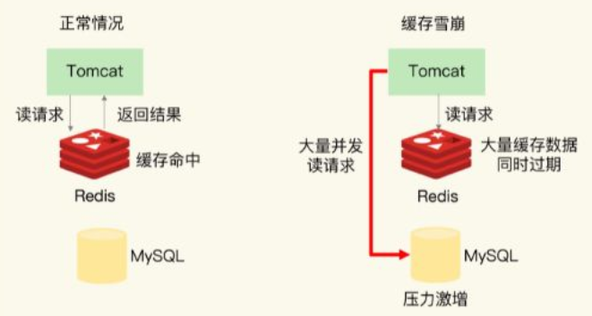

其实集中过期，倒不是非常致命，比较致命的缓存雪崩，是缓存服务器某个节点宕机或断网。因为自然形成的缓存雪崩，一定是在某个时间段集中创建缓存，这个时候，数据库也是可以顶住压力的。无非就是对数据库产生周期性的压力而已。而缓存服务节点的宕机，对数据库服务器造成的压力是不可预知的，很有可能瞬间就把数据库压垮。

#### 解决方案

> redis 高可用

这个思想的含义是， 既然 redis 有可能挂掉， 那我多增设几台 redis， 这样一台挂掉之后其他的还可以继续工作，其实就是搭建的集群。(异地多活)

> 限流降级

这个解决方案的思想是，在缓存失效后，通过加锁或者队列来控制读数据库写缓存的线程数量。比如对某个 key 只允许一个线程查询数据和写缓存，其他线程等待。

> 数据预热

数据预热的含义就是在正式部署之前，我先把可能的数据先预先访问一遍，这样部分可能大量访问的数据就会加载到缓存中。在即将发生大并发访问前手动触发加载缓存不同的 key， 设置不同的过期时间， 让缓存失效的时间点尽量均匀。
