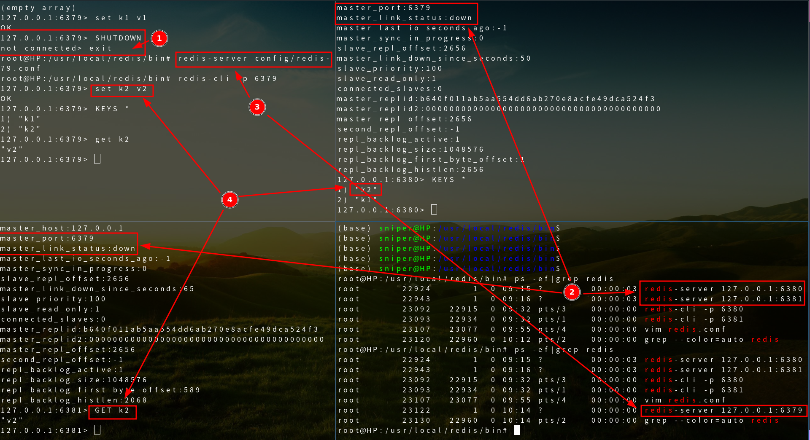
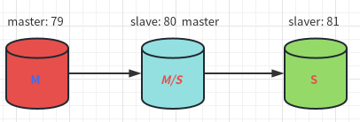

#

## Linux 安装

### 1. 下载安装包

`wget https://mirrors.huaweicloud.com/redis/redis-6.0.6.tar.gz`

### 2. 解压 redis 安装包

`tar -zxvf /home/sniper/redis-6.0.6.tar.gz -d /opt`


### 3. 安装

```bash
# 安装 gcc:
yum install gcc-c++
# 预编译
make
# 创建 redis 安装目录
mkdir -p /usr/local/redis
# 安装
make PREFIX=/usr/local/redis/ install
```


### 4. 启动

```bash
# 默认是前台启动
/usr/local/redis/bin/redis-server
# 修改redis.conf, 后台启动
cp /opt/redis-6.0.6/redis.conf /usr/local/redis/bin/
sed -i 's/daemonize no/daemonize yes/g' redis.conf
./redis-server ./redis.conf
```


### 5. 使用 redis-cli 进行连接测试


## Redis 主从复制

### 概念

主从复制，是指将一台 Redis 服务器的数据，复制到其他的 Redis 服务器。前者称为主节点（master／leader），后者称为从节点（slave／follower）；<mark> 数据的复制是单向的，只能由主节点到从节点。</mark> Master 以写为主，Slave 以读为主。

<mark>默认情况下，每台 Redis 服务器都是主节点；</mark>且一个主节点可以有多个从节点（或没有从节点），但一个从节点只能有一个主节点。

### 主从复制的作用

1. 数据冗余：主从复制实现了数据的热备份，是持久化之外的一种数据冗余方式。

2. 故障恢复：当主节点出现问题时，可以由从节点提供服务，实现快速的故障恢复；实际上是一种服务的冗余。

3. 负载均衡：在主从复制的基础上，配合读写分离，可以由主节点提供写服务，由从节点提供读服务（即写 Redis 数据时应用连接主节点，读 Redis 数据时应用连接从节点），分担服务器负载；尤其是在写少读多的场景下，通过多个从节点分担读负载，可以大大提高 Redis 服务器的并发量。

4. 高可用(集群)基石：除了上述作用以外，主从复制还是哨兵和集群能够实施的基础，因此说主从复制是 Redis 高可用的基础。

### 为什么使用主从复制

一般来说，要将 Redis 运用于工程项目中，只使用一台 Redis 是万万不能的(宕机, 最低就是 1 主 2 从)，原因如下：

1、从结构上，单个 Redis 服务器会发生单点故障，并且一台服务器需要处理所有的请求负载，压力较大；

2、从容量上，单个 Redis 服务器内存容量有限，就算一台 Redis 服务器内存容量为 256G，也不能将所有内存用作 Redis 存储内存，一般来说，<mark>单台 Redis 最大使用内存不应该超过 20G。</mark>

### 环境配置

只配置从库，不用配置主库，因为<mark>默认情况下，每台 Redis 服务器都是主库</mark>

```bash
127.0.0.1:6379> INFO replication  # 查看当前库的信息
# Replication
role:master  # 角色 master
connected_slaves:0  # 没有从机
master_replid:74ddc05e1ca9518ff9d6ebe0ca8b6847dc9a7ac8
master_replid2:0000000000000000000000000000000000000000
master_repl_offset:0
second_repl_offset:-1
repl_backlog_active:0
repl_backlog_size:1048576
repl_backlog_first_byte_offset:0
repl_backlog_histlen:0
```

复制 3 个配置文件，然后修改对应的配置信息

```
1、端口
2、pid 名字
3、log 文件名字
4、dump.rdb 名字
```

修改完毕后，启动 3 个 redis 服务器，可以通过进程信息查看


### 一主二从

#### 架构图


#### 命令方式配置

<mark>默认情况下，每台 Redis 服务器都是主节点</mark> 我们一般情况下只用配置从机就好了

认老大！一主(79)二从(80, 81)

```bash
127.0.0.1:6380> SLAVEOF 127.0.0.1 6379  # 找谁当自己的老大
OK
127.0.0.1:6380> INFO replication
# Replication
role:slave  # 当前的角色是从机
master_host:127.0.0.1  # 可以看到主机的信息
master_port:6379
master_link_status:up
master_last_io_seconds_ago:2
master_sync_in_progress:0
slave_repl_offset:14
slave_priority:100
slave_read_only:1
connected_slaves:0
master_replid:b640f011ab5aa554dd6ab270e8acfe49dca524f3
master_replid2:0000000000000000000000000000000000000000
master_repl_offset:14
second_repl_offset:-1
repl_backlog_active:1
repl_backlog_size:1048576
repl_backlog_first_byte_offset:1
repl_backlog_histlen:14

# 在主机中查看
127.0.0.1:6379> INFO replication
# Replication
role:master
connected_slaves:1  # 多了从机的配置信息
slave0:ip=127.0.0.1,port=6380,state=online,offset=56,lag=1  # 多了从机信息
master_replid:b640f011ab5aa554dd6ab270e8acfe49dca524f3
master_replid2:0000000000000000000000000000000000000000
master_repl_offset:56
second_repl_offset:-1
repl_backlog_active:1
repl_backlog_size:1048576
repl_backlog_first_byte_offset:1
repl_backlog_histlen:56
```

如果两个都配置完了，就是有两个从机的信息


#### 配置文件方式配置

真实的主从配置应该在配置文件中配置，这样是永久的;我们这里使用的是命令配置，是暂时的！


#### 具体细节

1、主机可以写，从机不能写只能读！主机中的所有信息和数据，都会自动被从机保存


2、主机断开连接，从机依旧连接到主机的，但是没有写操作; 如果主机重新连接了，从机依旧可以直接获取到主机写的信息！



3、使用命令方式配置主从，如果从机重启了，就会断开与主机的主从关系; 只要重新配置成从机，立马就会同步到主机的数据


### 层层链路

上一个 master 链接下一个 slave

#### 架构图




### 手动选举

- 如果没有老大(master)了，能不能选择一个新的出来？需要手动修改
- 使用命令 `SLAVEOF no one` 让自己变成主机！其他节点可以手动连接到最新的这个主机;即使原老大(master)重新启动了，也不会恢复到原来的主从关系


### 哨兵模式-自动选举

### 复制原理

Slave 启动成功连接到 master 后会发送一个 sync 同步命令

Master 接到命令，启动后台的存盘进程，同时收集所有接收到的用于修改数据集命令，在后台进程执行完毕之后，<mark>master 将传送整个数据文件到 slave，并完成一次完全同步。</mark>

<mark>全量复制：</mark> 而 Tslave 服务在接收到数据库文件数据后，将其存盘并加载到内存中。

<mark>增量复制：</mark> Master 继续将新的所有收集到的修改命令依次传给 slave，完成同步

但是只要是重新连接 master，一次完全同步（全量复制）将被自动执行！我们的数据一定可以在从机中看到！
